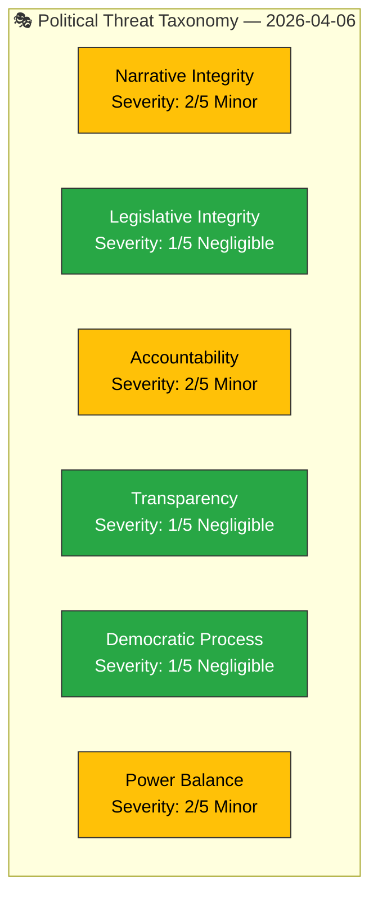
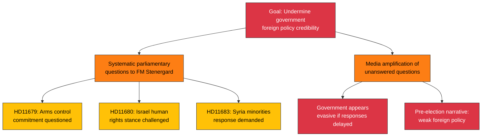

# 🎭 Political Threat Analysis — 2026-04-06

**Generated**: 2026-04-06 14:20 UTC | **Produced By**: news-realtime-monitor (realtime-1420)
**Documents Analyzed**: 9 | **Confidence**: MEDIUM

---

## 📋 Threat Analysis Context

| Field | Value |
|-------|-------|
| **Threat Analysis ID** | THR-2026-04-06-1420 |
| **Analysis Date** | 2026-04-06 14:20 UTC |
| **Analysis Period** | 2026-W14 (Easter recess) |
| **Produced By** | news-realtime-monitor |
| **Political Context** | Kristersson coalition in Easter recess. No active votes. Opposition uses written questions to build policy narratives. |
| **Overall Threat Level** | LOW |

---

## 🏷️ Political Threat Taxonomy Assessment

| Category | Severity | Evidence | Assessment |
|----------|:--------:|----------|------------|
| **Narrative Integrity** | 2/5 | HD11679, HD11680, HD11683 | S uses written questions to challenge government foreign policy narrative |
| **Legislative Integrity** | 1/5 | HD01FöU12, HD01JuU15 | Normal legislative process; government proposals adopted per procedure |
| **Accountability** | 2/5 | HD10428, HD11681 | Opposition probes government decisions on airports and mining permits |
| **Transparency** | 1/5 | — | No transparency concerns identified in current document set |
| **Democratic Process** | 1/5 | — | Normal parliamentary procedures observed; Easter recess standard |
| **Power Balance** | 2/5 | HD01JuU15 Res. 1 | 4-party opposition alignment (S+V+C+MP) indicates evolving power dynamics |

---

## 🌲 Attack Tree — Top Threat: Opposition Narrative Coordination

---

## 📈 Forward Indicators

| Indicator | Escalation Signal | MCP Tool |
|-----------|-------------------|----------|
| FM Stenergard response timing | > 3 weeks delay on any question | search_dokument |
| Follow-up interpellations on same topics | S files IP on arms control or Israel | get_interpellationer |
| Media coverage of unanswered questions | Debate articles by S foreign policy spokespersons | search_regering |

---

## 📋 Document Control

**Analysis Version**: 1.0 | **Analyst**: news-realtime-monitor | **Classification**: Public
