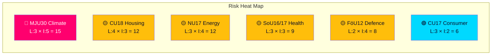

# Political Risk Assessment — 2026-04-07

| **Key** | **Value** |
|---------|-----------|
| **ID** | RISK-2026-04-07-CR01 |
| **Generated** | 2026-04-07 04:33 UTC |
| **Documents Analyzed** | 20 |
| **Riksmöte** | 2025/26 |
| **Overall Confidence** | MEDIUM |

## Risk Matrix (Likelihood × Impact, 1-5 scale)

| Risk | Likelihood | Impact | Score | Level | Evidence |
|------|-----------|--------|-------|-------|----------|
| SD withdraws climate support over MJU30 EU-aligned targets | 3 | 5 | 15 | 🔴 HIGH | MJU30 beredning scheduled May-June; SD opposes EU climate mandates |
| Housing crisis escalation after 131 motions rejected (CU18) | 4 | 3 | 12 | 🟡 MEDIUM | CU18 — all 131 motions rejected, no alternative proposed |
| Energy policy deadlock from NU17 mass rejection | 3 | 4 | 12 | 🟡 MEDIUM | NU17 — 132 electricity motions rejected |
| Consumer protection gaps widen after CU17 | 3 | 2 | 6 | 🟢 LOW | CU17 — 83 consumer motions rejected |
| Defence readiness implementation delay for FöU12 | 2 | 4 | 8 | 🟡 MEDIUM | FöU12 — strengthening civil protection requires legislative follow-up |
| Healthcare reform stagnation from SoU16/SoU17 inaction | 3 | 3 | 9 | 🟡 MEDIUM | SoU16, SoU17 — deferred to "ongoing work" |

## Coalition Risk Assessment

**Coalition Risk Score**: 18/100 (LOW-MEDIUM)
- Base stability from M-KD-L alignment on defence/justice
- Key vulnerability: MJU30 climate targets could test SD support arrangement
- Cross-party anomalies detected: High KD-M alignment (88.5%), L-M alignment (87.9%)

## Key Findings

1. **Highest risk**: SD withdrawal over EU climate targets (MJU30) — chamber debate June 17 [HIGH]
2. **Systemic risk**: Mass motion rejections in housing (131), electricity (132), and consumer rights (83) signal democratic responsiveness concerns [MEDIUM]
3. **Defence implementation**: FöU12 civil protection bill has broad support but implementation timeline uncertain [MEDIUM]

## Data Quality Notes

Risk assessment derived from 20 committee reports, coalition metrics, and legislative calendar analysis.
