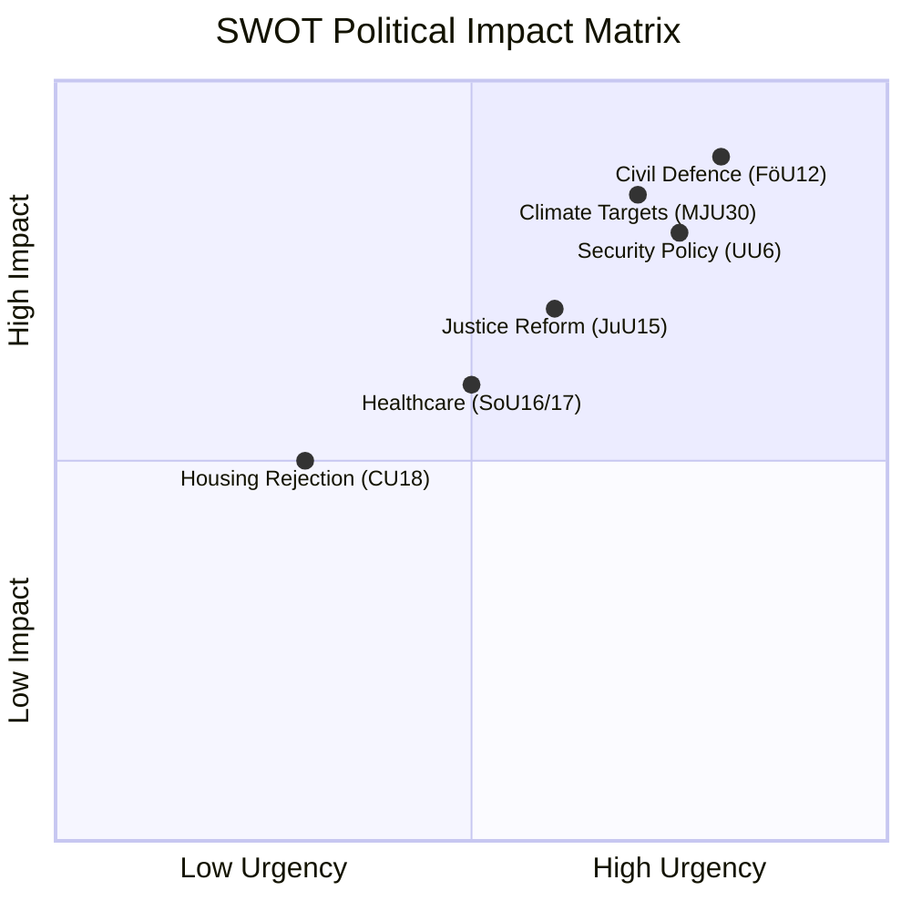

# Political SWOT Analysis — 2026-04-07

| **Key** | **Value** |
|---------|-----------|
| **ID** | SWOT-2026-04-07-CR01 |
| **Generated** | 2026-04-07 04:33 UTC |
| **Documents Analyzed** | 20 |
| **Riksmöte** | 2025/26 |
| **Overall Confidence** | MEDIUM |

## Strengths (Government Coalition — M, KD, L with SD support)

| # | Statement | Evidence (dok_id) | Confidence | Impact | Entry Date |
|---|-----------|-------------------|------------|--------|------------|
| S1 | Government advances civil defence bill unopposed | FöU12 — unanimous committee approval | HIGH | High | 2026-04-02 |
| S2 | Criminal corrections agenda reflects coalition priority | JuU15 — consolidated justice package | MEDIUM | Medium | 2026-04-02 |
| S3 | Broad committee coverage shows legislative productivity | 20 reports across 12 committees in 8 days | HIGH | Medium | 2026-04-07 |
| S4 | Security policy report strengthens NATO narrative | UU6 — security policy committee report | HIGH | High | 2026-03-31 |

## Weaknesses (Government Coalition)

| # | Statement | Evidence (dok_id) | Confidence | Impact | Entry Date |
|---|-----------|-------------------|------------|--------|------------|
| W1 | 131 housing motions rejected — signals policy vacuum | CU18 — mass motion rejection | MEDIUM | Medium | 2026-03-27 |
| W2 | Climate target report delayed to June — internal friction | MJU30 — planning status, beredning May-June | MEDIUM | High | 2026-03-30 |
| W3 | Healthcare reports defer to "ongoing work" | SoU16, SoU17 — status quo bias | MEDIUM | Medium | 2026-04-01 |

## Opportunities

| # | Statement | Evidence (dok_id) | Confidence | Impact | Entry Date |
|---|-----------|-------------------|------------|--------|------------|
| O1 | EU cultural strategy alignment potential | KrU10 — culture compass engagement | MEDIUM | Low | 2026-03-27 |
| O2 | Minority language policy could build cross-party consensus | KU31 — Riksrevisionen report received | MEDIUM | Medium | 2026-03-27 |
| O3 | Parliamentary reform through KU38 modernization | KU38 — constitutional committee process | HIGH | High | 2026-03-30 |

## Threats

| # | Statement | Evidence (dok_id) | Confidence | Impact | Entry Date |
|---|-----------|-------------------|------------|--------|------------|
| T1 | Climate targets debate may fracture SD support arrangement | MJU30 — EU-aligned targets challenge SD position | HIGH | High | 2026-03-30 |
| T2 | Consumer protection gap amid 83 rejected motions | CU17 — broad motion rejection | MEDIUM | Medium | 2026-03-27 |
| T3 | Energy policy stalemate with 132 rejected electricity motions | NU17 — mass rejection of opposition proposals | MEDIUM | High | 2026-03-26 |

## Data Quality Notes

SWOT confidence: MEDIUM. Based on committee report metadata and summaries from 20 betänkanden. Full-text analysis available for FöU12 and JuU15.
