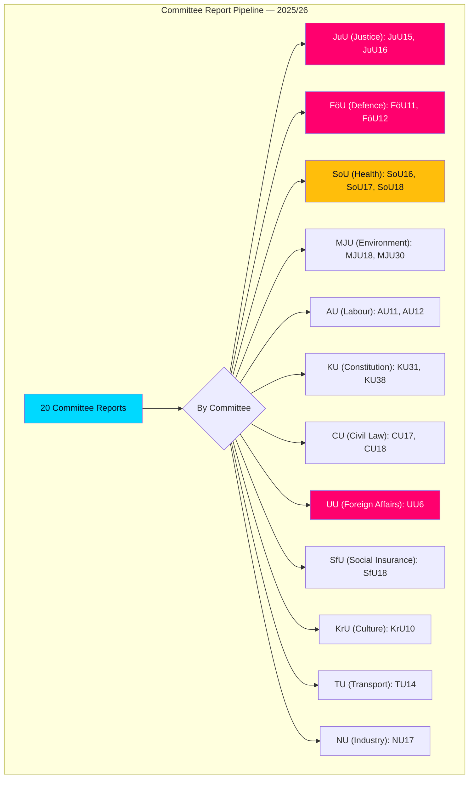

# Analysis Synthesis Summary — 2026-04-07

| **Key** | **Value** |
|---------|-----------|
| **ID** | SYN-2026-04-07-CR01 |
| **Generated** | 2026-04-07 04:32 UTC |
| **Data Sources** | get_betankanden, get_dokument, search_voteringar |
| **Documents Analyzed** | 20 |
| **Riksmöte** | 2025/26 |
| **Overall Confidence** | MEDIUM |

## Executive Summary

The Swedish Riksdag's committee system produced 20 betänkanden (committee reports) between March 26 and April 2, 2026, spanning 12 of 15 standing committees. The most consequential reports address **civil defence preparedness** (FöU12), **criminal corrections reform** (JuU15), **security policy** (UU6), and **Sweden's EU-aligned climate targets** (MJU30). The volume signals an acceleration of legislative activity as the 2025/26 session approaches its final quarter.

## Key Findings

1. **Defence & Security Surge** [HIGH]: FöU12 strengthens civilian protection during heightened readiness — directly responding to NATO membership obligations. UU6 addresses security policy in the context of Sweden's evolving geopolitical position.
2. **Justice Cluster** [HIGH]: JuU15 (criminal corrections) and JuU16 (police issues) reflect continued government focus on law enforcement and the penal system — key election themes.
3. **Healthcare Dual Reports** [MEDIUM]: SoU16 (organization) and SoU17 (priorities) address structural healthcare reform — politically sensitive given regional healthcare disparities.
4. **Climate Policy Crossroads** [HIGH]: MJU30 proposes EU-aligned climate targets for 2030 — scheduled for June debate. A major policy direction indicator.
5. **Constitutional Reform** [MEDIUM]: KU38 addresses parliamentary process reform — rare and significant for institutional evolution.

## Data Freshness

**Data Freshness**: Documents sourced from **2026-04-02** (most recent published reports)

## Implications

The breadth of committee activity across 12 committees signals the session is entering its productive phase. Security/defence reports (FöU11, FöU12, UU6) dominate in political significance given Sweden's NATO membership context. The justice cluster (JuU15, JuU16) reinforces the government's law-and-order agenda. Climate targets (MJU30) will be the most contested when reaching the chamber floor in June.
