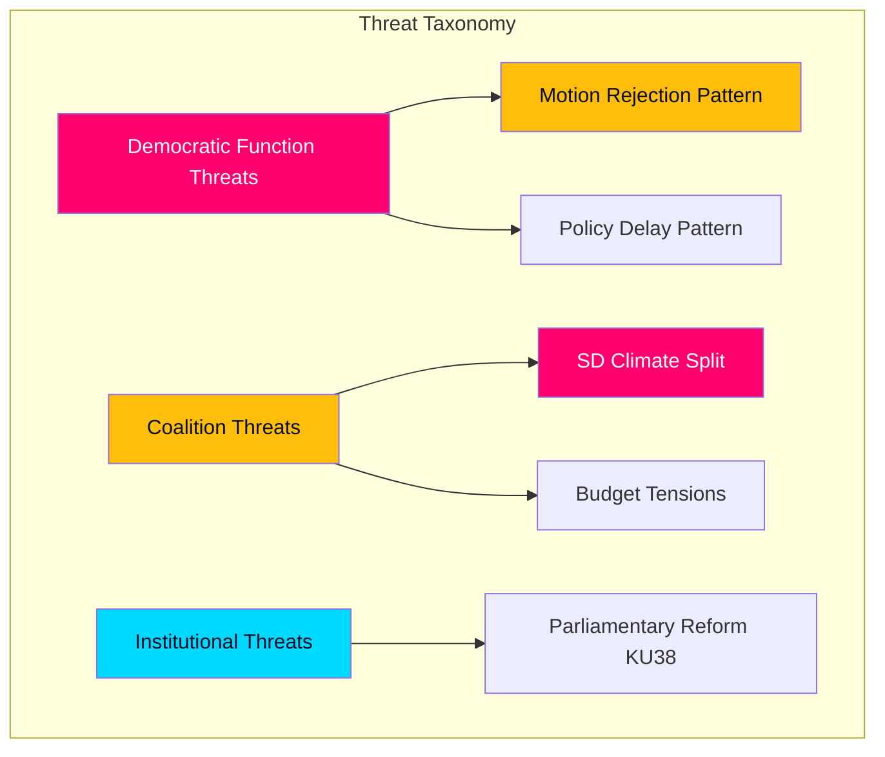

# Political Threat Analysis — 2026-04-07

| **Key** | **Value** |
|---------|-----------|
| **ID** | THREAT-2026-04-07-CR01 |
| **Generated** | 2026-04-07 04:34 UTC |
| **Documents Analyzed** | 20 |
| **Riksmöte** | 2025/26 |
| **Overall Confidence** | MEDIUM |

## Threat Assessment

### Democratic Responsiveness Threats

| Threat | Category | Severity | Evidence |
|--------|----------|----------|----------|
| Mass motion rejection pattern | Democratic Deficit | 🟡 MEDIUM | CU18 (131), NU17 (132), CU17 (83) — 346 motions rejected in 3 reports |
| Climate policy delay | Policy Stagnation | 🟡 MEDIUM | MJU30 — beredning not until May 2026 |
| Healthcare reform inertia | Service Delivery | 🟡 MEDIUM | SoU16, SoU17 — deferred to "pågående arbete" |

### Coalition Stability Threats

| Threat | Category | Severity | Evidence |
|--------|----------|----------|----------|
| SD climate policy divergence | Coalition Fracture | 🔴 HIGH | MJU30 EU-aligned targets conflict with SD platform |
| Defence spending disagreements | Budget Tension | 🟢 LOW | FöU12 has broad support but implementation costs unclear |

## Data Quality Notes

Threat analysis confidence: MEDIUM. Based on committee report metadata, legislative calendar, and coalition dynamics.
