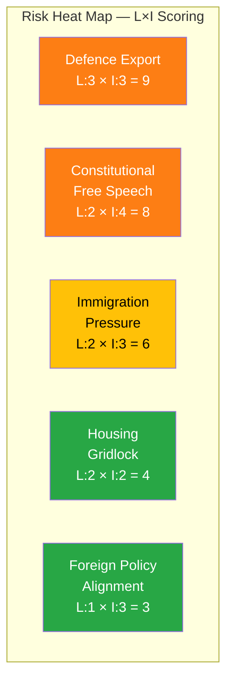

# Political Risk Assessment — 2026-04-07

| **Key** | **Value** |
|---------|-----------|
| **ID** | RSK-2026-04-07-EVE |
| **Date** | 2026-04-07 |
| **Riksmöte** | 2025/26 |
| **Overall Confidence** | MEDIUM |
| **Coalition Risk Score** | 4/100 (LOW) |

## Risk Heat Map

## Risk Matrix

| Risk Category | Description | L (1-5) | I (1-5) | L×I | Evidence | Confidence |
|---------------|-------------|---------|---------|-----|----------|------------|
| Defence Export Policy | Strategic export control review (HD03114) amid geopolitical shifts; war materiel regulation modernization (HD03228) may face scrutiny | 3 | 3 | 9 | HD03114, HD03228 | MEDIUM |
| Constitutional/Free Speech | SD interpellation on free speech vs prop. 2025/26:133 (HD10429); mosque hate speech debate (HD10430) | 2 | 4 | 8 | HD10429, HD10430 | MEDIUM |
| Immigration Pressure | SD questions on Syrian returns (HD11684), coalition stability risk from persistent immigration agenda | 2 | 3 | 6 | HD11684, HD03235 | MEDIUM |
| Housing Policy | Municipal housing guarantee motions (HD024067) — policy gridlock potential | 2 | 2 | 4 | HD024067 | LOW |
| Foreign Policy Alignment | Cuba policy question (HD11685) probes US alignment; export control intersects NATO cooperation | 1 | 3 | 3 | HD11685, HD03114 | LOW |

## Coalition Stability Assessment

Coalition voting discipline remains strong with a risk score of 4/100. No anomalous voting patterns detected in recent data. The Tidö Agreement parties (M, KD, L with SD support) continue to coordinate effectively on the legislative agenda. [HIGH confidence]

## Forward Indicators

| Indicator | Trigger | Timeline | Confidence |
|-----------|---------|----------|------------|
| Committee referral of strategic export control report (HD03114) | UU committee scheduling | 1-2 weeks | MEDIUM |
| Vote on stricter deportation rules (HD03235) | JuU committee deliberation completion | 2-4 weeks | HIGH |
| Cybersecurity center bill (HD03214) plenary debate | FöU committee report | 2-3 weeks | MEDIUM |
| Response to mosque interpellation (HD10430) | Minister Forssmed response scheduling | 1-2 weeks | HIGH |
