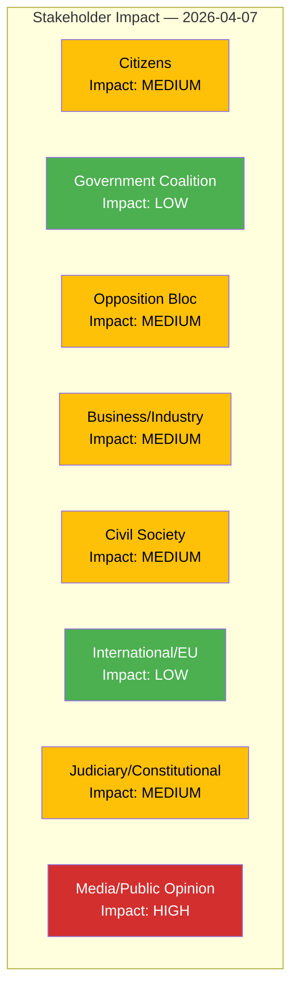

# Stakeholder Impact Analysis — 2026-04-07

| **Key** | **Value** |
|---------|-----------|
| **ID** | STA-2026-04-07-EVE |
| **Date** | 2026-04-07 |
| **Riksmöte** | 2025/26 |
| **Overall Confidence** | MEDIUM |

## Impact Radar

## Stakeholder Assessments

| Group | Impact | Key Concerns | Evidence |
|-------|--------|--------------|----------|
| **Citizens** | MEDIUM | Food security (HD024069), housing guarantees (HD024067), religious freedom vs. hate speech (HD10430) | HD024069, HD024067, HD10430 |
| **Government Coalition** | LOW | Managing SD pressure while advancing legislative agenda; export control obligations (HD03114) | HD03114, coalition score 4/100 |
| **Opposition Bloc** | MEDIUM | SD dominates instruments (5/9); MP files counter-motions but lacks agenda-setting power | HD11684-HD10429 (SD), HD024067-69 (MP) |
| **Business/Industry** | MEDIUM | Strategic export control (HD03114) affects defence industry; hunting legislation simplification (HD024068) impacts rural sector | HD03114, HD024068 |
| **Civil Society** | MEDIUM | Mosque debate (HD10430) directly impacts Muslim communities; free speech debate (HD10429) concerns advocacy groups | HD10430, HD10429 |
| **International/EU** | LOW | Export control report (HD03114) signals compliance with international arms trade norms; Syria/Cuba questions probe bilateral relations | HD03114, HD11684, HD11685 |
| **Judiciary/Constitutional** | MEDIUM | Free speech interpellation (HD10429) targeting prop. 2025/26:133 raises constitutional review questions | HD10429 |
| **Media/Public Opinion** | HIGH | Mosque hate speech and Syrian return topics generate significant media attention; export control report of defence journalism interest | HD10430, HD11684, HD03114 |
