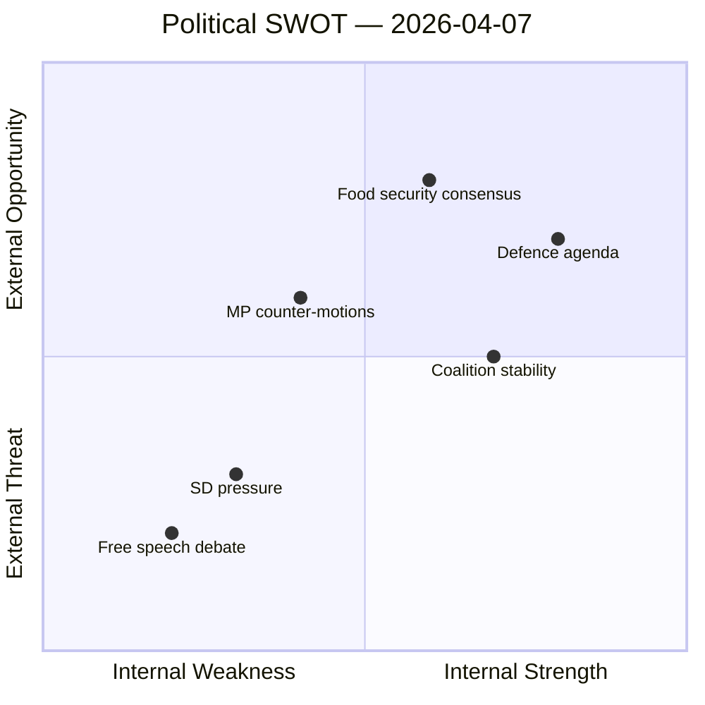

# Political SWOT Analysis — 2026-04-07

| **Key** | **Value** |
|---------|-----------|
| **ID** | SWT-2026-04-07-EVE |
| **Date** | 2026-04-07 |
| **Riksmöte** | 2025/26 |
| **Overall Confidence** | MEDIUM |
| **Documents Analyzed** | 9 |

## Quadrant Mapping

## Strengths

| Evidence | dok_id | Confidence |
|----------|--------|------------|
| Government maintains high legislative output: strategic export control report (HD03114) tabled today | HD03114 | MEDIUM |
| Coalition voting discipline strong — risk score 4/100 from CIA metrics | Coalition data | HIGH |
| Multi-front security agenda: cybersecurity center (HD03214), war materiel rules (HD03228), deportation (HD03235) all advancing | HD03214, HD03228, HD03235 | HIGH |
| Healthcare reforms progressing: medical competence bill (HD03216), healthcare priorities (SoU16/17) | HD03216, HD01SoU16, HD01SoU17 | MEDIUM |

## Weaknesses

| Evidence | dok_id | Confidence |
|----------|--------|------------|
| SD files 5 of 9 parliamentary instruments — dominates today's agenda with immigration/integration themes | HD11684, HD11685, HD11686, HD10430, HD10429 | HIGH |
| Government skrivelse (HD03114) lacks detailed summary — limited transparency on export control specifics | HD03114 | MEDIUM |
| Opposition motions (MP) reactive rather than proactive — responding to government propositions | HD024067, HD024068, HD024069 | MEDIUM |

## Opportunities

| Evidence | dok_id | Confidence |
|----------|--------|------------|
| Food stockpile motion (HD024069) responding to prop. 2025/26:205 could build civil preparedness consensus | HD024069 | MEDIUM |
| Housing guarantee legislation (prop. 2025/26:212) addresses social sustainability — broad appeal potential | HD024067 | MEDIUM |
| Strategic export control review enables Nordic defence cooperation strengthening amid NATO membership | HD03114 | LOW |

## Threats

| Evidence | dok_id | Confidence |
|----------|--------|------------|
| Freedom of expression interpellation (HD10429) targeting prop. 2025/26:133 signals constitutional tension | HD10429 | MEDIUM |
| Mosque hate-speech interpellation (HD10430) risks polarising religious freedom debate | HD10430 | MEDIUM |
| Syrian return question (HD11684) references German policy shift — external pressure on migration stance | HD11684 | LOW |
| Cuba policy question (HD11685) probes foreign policy alignment with US — potential coalition friction | HD11685 | LOW |
