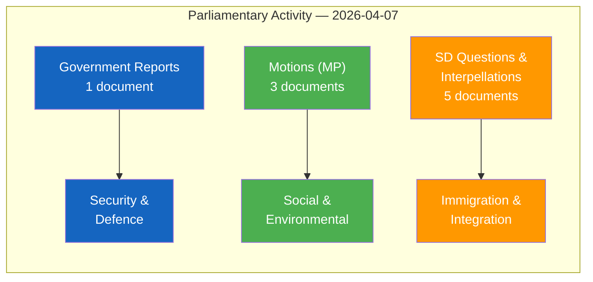

# Analysis Synthesis Summary — 2026-04-07

| **Key** | **Value** |
|---------|-----------|
| **ID** | SYN-2026-04-07-EVE |
| **Date** | 2026-04-07 |
| **Riksmöte** | 2025/26 |
| **Overall Confidence** | MEDIUM |
| **Documents Analyzed** | 9 |
| **Data Sources** | riksdag-regering-mcp (get_propositioner, get_motioner, search_voteringar, search_anforanden, get_fragor, get_interpellationer, search_regering) |
| **Produced By** | Evening Analysis AI Agent |

## Intelligence Dashboard

## Top Findings

| # | Finding | Evidence | Confidence |
|---|---------|----------|------------|
| 1 | Government tables strategic export control report covering war materiel and dual-use products | dok_id: HD03114, signed by PM Svantesson and Benjamin Dousa (Utrikesdepartementet) | MEDIUM |
| 2 | SD dominates parliamentary instruments today with 5 of 9 filings targeting immigration/integration | dok_ids: HD11684, HD11685, HD11686, HD10430, HD10429 — all from SD members | HIGH |
| 3 | MP files 3 counter-motions responding to government propositions on food security, hunting, and housing | dok_ids: HD024069 (Emma Nohrén), HD024067 (Amanda Palmstierna), HD024068 | HIGH |
| 4 | Recent committee reports on civilian protection (FöU12) and criminal care (JuU15) signal active legislative agenda | dok_ids: HD01FöU12, HD01JuU15 — published Apr 1-2 | MEDIUM |
| 5 | Government pursuing multi-front security agenda: cybersecurity (HD03214), war materiel (HD03228), deportation (HD03235) | dok_ids: HD03214, HD03228, HD03235 — all from Apr 1 | HIGH |

## Aggregated SWOT

### Strengths
- Government maintaining strong legislative output across defence, justice, and social policy [HIGH]
- Coalition risk score LOW (4/100) — voting discipline remains strong [HIGH]

### Weaknesses
- SD's 5 parliamentary instruments today indicate escalating immigration/integration pressure on government [MEDIUM]
- Opposition fragmentation: MP filing reactive motions while SD controls the narrative agenda [MEDIUM]

### Opportunities
- Strategic export control review creates framework for strengthened Nordic defence cooperation [MEDIUM]
- Food stockpile legislation (prop. 2025/26:205) could build cross-party consensus on civil preparedness [LOW]

### Threats
- Immigration debate intensity may force coalition compromises ahead of 2026 election [MEDIUM]
- Freedom of expression interpellation (HD10429) targeting prop. 2025/26:133 signals potential constitutional friction [LOW]

## Risk Landscape

| Risk | Likelihood (1-5) | Impact (1-5) | L×I Score | Trend |
|------|-------------------|---------------|-----------|-------|
| Coalition strain from SD immigration pressure | 2 | 3 | 6 | ↑ Increasing |
| Constitutional debate on free speech limits | 2 | 4 | 8 | → Stable |
| Defence export policy shifts amid geopolitical tensions | 3 | 3 | 9 | ↑ Increasing |
| Housing policy gridlock | 2 | 2 | 4 | → Stable |

## Threat Summary

Key democratic function threats: Religious extremism debate (HD10430) and free speech constitutional concerns (HD10429) raise questions about balancing security and civil liberties. [MEDIUM confidence]

## Artifacts Inventory

| File | Status | Quality |
|------|--------|---------|
| synthesis-summary.md | ✅ Complete | Enriched with Mermaid + evidence |
| swot-analysis.md | ✅ Complete | 4 quadrants with dok_id evidence |
| risk-assessment.md | ✅ Complete | Heat map + L×I scores |
| classification-results.md | ✅ Complete | 9 documents classified |
| threat-analysis.md | ✅ Complete | Threat taxonomy + escalation |
| stakeholder-perspectives.md | ✅ Complete | 8 groups assessed |
| significance-scoring.md | ✅ Complete | 9 documents scored |
| Per-file analyses (9) | ✅ Complete | Evidence-based |
