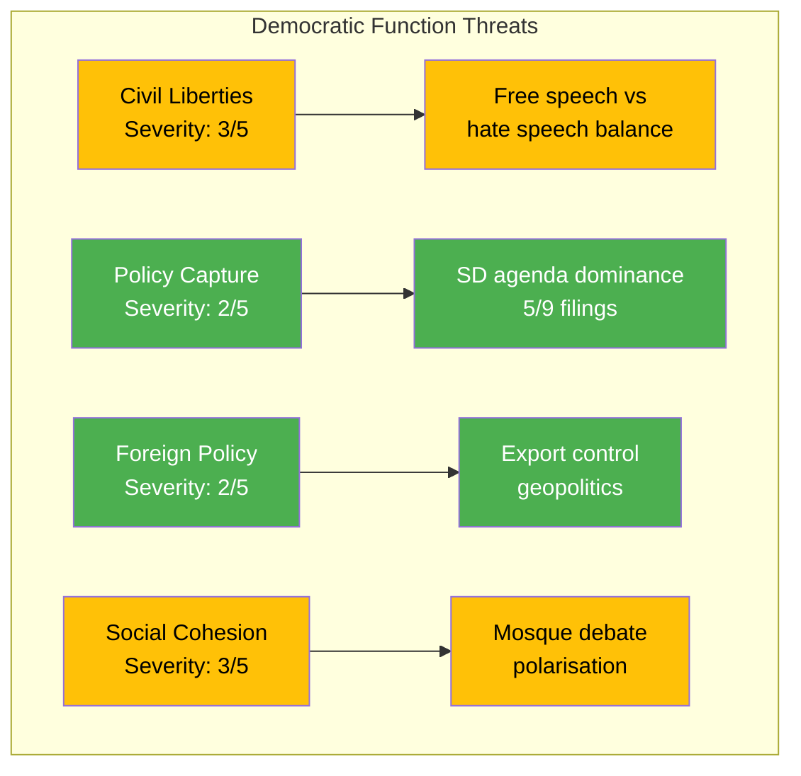

# Political Threat Analysis — 2026-04-07

| **Key** | **Value** |
|---------|-----------|
| **ID** | THR-2026-04-07-EVE |
| **Date** | 2026-04-07 |
| **Riksmöte** | 2025/26 |
| **Overall Confidence** | MEDIUM |

## Threat Taxonomy Network

## Threat Categories

| Category | Severity (1-5) | Evidence | dok_id | Confidence |
|----------|----------------|----------|--------|------------|
| Civil Liberties Balance | 3 | SD interpellation on free speech protection vs prop. 2025/26:133 challenges government to clarify constitutional limits | HD10429 | MEDIUM |
| Social Cohesion | 3 | Mosque hate speech interpellation risks amplifying polarisation; references Expressen investigations | HD10430 | MEDIUM |
| Policy Agenda Capture | 2 | SD files 5/9 documents today — disproportionate agenda influence despite support-party status | HD11684, HD11685, HD11686, HD10430, HD10429 | HIGH |
| Foreign Policy Independence | 2 | Cuba policy alignment question + strategic export control amid NATO obligations | HD11685, HD03114 | LOW |
| Democratic Deliberation | 1 | Opposition motions (MP) ensure counter-arguments on food security, housing, hunting reform | HD024067, HD024068, HD024069 | HIGH |
| Electoral Competition | 2 | Immigration-focused SD agenda positions party for 2026 election campaign | All SD dok_ids | MEDIUM |

## Escalation Assessment

Current threat levels are MODERATE overall. The primary concern is the civil liberties vs. security balance, where constitutional principles may come under strain if the mosque and free speech debates converge. No immediate escalation triggers detected. [MEDIUM confidence]
