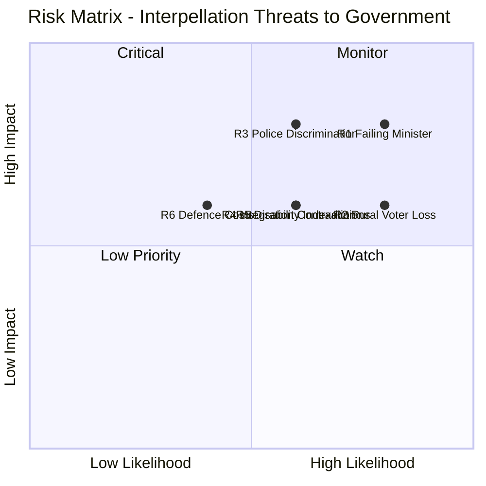

# Political Risk Assessment — 2026-04-07 Interpellations

| **Key** | **Value** |
|---------|-----------|
| **Document ID** | RISK-2026-04-07-IP |
| **Date** | 2026-04-07 |
| **Riksmöte** | 2025/26 |
| **Overall Confidence** | MEDIUM |
| **Documents Analyzed** | 15 |

## Risk Matrix (5×5 Likelihood × Impact)

| Risk ID | Risk Description | Likelihood (1-5) | Impact (1-5) | L×I Score | Priority |
|---------|-----------------|-------------------|--------------|-----------|----------|
| R1 | "Failing minister" narrative on Carlson consolidates before election | 4 | 4 | 16 | HIGH |
| R2 | Regional airline cuts alienate rural KD/C voters | 4 | 3 | 12 | HIGH |
| R3 | Police discrimination case damages government credibility | 3 | 4 | 12 | HIGH |
| R4 | Integration policy contradictions exposed by dual ministerial targeting | 3 | 3 | 9 | MEDIUM |
| R5 | Disability assistance indexation failure breaks cross-party trust | 3 | 3 | 9 | MEDIUM |
| R6 | Defence infrastructure costs strain municipal budgets | 2 | 3 | 6 | LOW |

## Forward Indicators

| Indicator | Trigger | Timeline | Confidence |
|-----------|---------|----------|------------|
| Carlson chamber debates scheduled | 8 responses due within 4 weeks | By May 2, 2026 | HIGH |
| Minister contradictions in debate | Svantesson vs Britz integration answers | April-May 2026 | MEDIUM |
| Regional media coverage | Airline/railway cut announcements | Ongoing | HIGH |
| Disability assistance indexation bill | Government budget proposal | September 2026 | MEDIUM |
| Police DO case ruling | Court proceedings | Q3-Q4 2026 | LOW |
