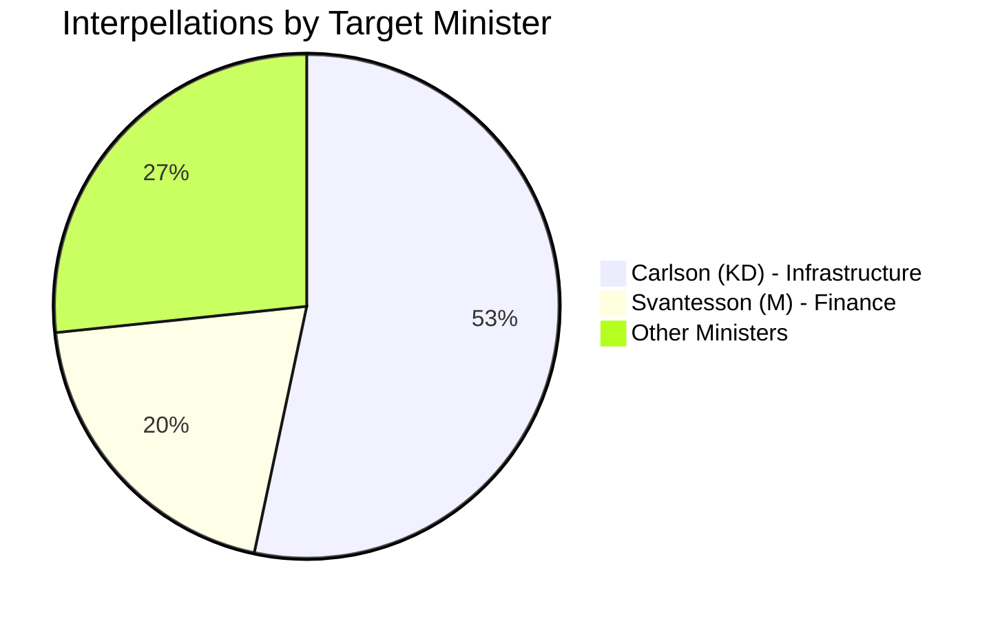
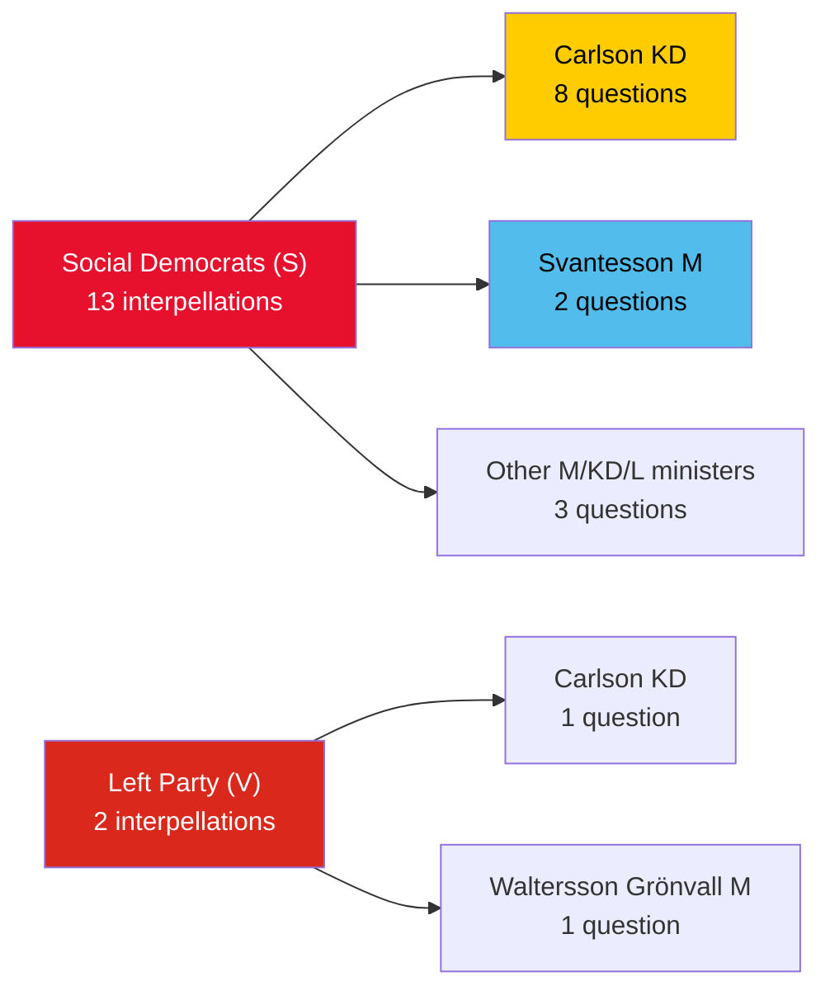

# Analysis Synthesis Summary — 2026-04-07

| **Key** | **Value** |
|---------|-----------|
| **Document ID** | SYN-2026-04-07-IP |
| **Date** | 2026-04-07 |
| **Riksmöte** | 2025/26 |
| **Overall Confidence** | MEDIUM |
| **Generated** | 2026-04-07 06:54 UTC |
| **Data Sources** | get_interpellationer, search_anforanden |
| **Documents Analyzed** | 15 |

## Summary

Fifteen interpellations (frs 2025/26:411–428) filed between March 25 and April 2, 2026 reveal a coordinated Social Democrat strategy targeting eight government ministers ahead of the 2026 election. Infrastructure Minister Andreas Carlson (KD) faces an extraordinary concentration of 8 interpellations on regional transport issues, making him the single most scrutinized minister. The Left Party (V) contributes two focused interpellations on disability rights.

## Key Findings

1. **Minister Concentration**: Carlson (KD) targeted 8 times — airports, airlines, railways, roads, housing, accessibility [HIGH confidence]
2. **Party Coordination**: S files 13/15 interpellations across 8 different ministers [HIGH confidence]
3. **Multi-front Strategy**: Lawen Redar (S) files 3 interpellations to 3 ministers simultaneously [HIGH confidence]
4. **Disability Rights Focus**: V's Nadja Awad creates pincer between infrastructure (Carlson) and social services (Waltersson Grönvall) [MEDIUM confidence]
5. **Pre-election Positioning**: Timing suggests deliberate campaign messaging 6 months before September 2026 election [MEDIUM confidence]

## Ministerial Accountability Scorecard

## Top Documents by Significance

| Score | Type | dok_id | Title | Target Minister |
|-------|------|--------|-------|-----------------|
| 7/10 | ip | HD10420 | Police Authority Discrimination | Strömmer (M) |
| 7/10 | ip | HD10426 | Israel Death Penalty Laws | Malmer Stenergard (M) |
| 6/10 | ip | HD10428 | Emergency Airport | Carlson (KD) |
| 6/10 | ip | HD10423 | Social Dumping | Slottner (KD) |
| 6/10 | ip | HD10416 | Disability Rights Review | Waltersson Grönvall (M) |

## Opposition Filing Pattern

## Implications

Overall political risk level: **MEDIUM**. The concentration of interpellations on Carlson signals a strategic opposition decision to establish a "failing minister" narrative. The government must respond to each within 4 weeks, creating multiple debate opportunities in the chamber.

## Data Quality Notes

Overall confidence: **MEDIUM**. Analysis based on 15 live MCP interpellations with full metadata. Minister response data not yet available for newest interpellations.
**Data Freshness**: Documents sourced from **2026-04-02** (most recent filing date). Interpellations span 2026-03-20 to 2026-04-02.
