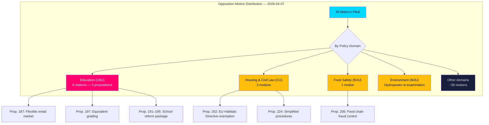

# Analysis Synthesis Summary — 2026-04-07

| **Key** | **Value** |
|---------|-----------|
| **ID** | SYN-2026-04-07-MOT |
| **Generated** | 2026-04-07 07:04 UTC (improved 2026-04-07 11:30 UTC) |
| **Data Sources** | get_motioner, search_dokument |
| **Documents Analyzed** | 50 |
| **Riksmöte** | 2025/26 |
| **Overall Confidence** | MEDIUM |

## Executive Summary

Opposition parties filed 50 motions in response to government propositions, with a dominant cluster in **education policy** (6 motions responding to 5 propositions) and significant activity in **housing/civil law** (3 motions), **food safety** (1 motion), and **hydropower/environment** (1 motion). The motions are overwhelmingly *följdmotioner* (response motions) to government bills, signalling structured opposition engagement rather than independent legislative initiative. The education cluster — spanning curricula reform (Prop. 2025/26:194), grading systems (Prop. 2025/26:197), school safety (Prop. 2025/26:193), and school support (Prop. 2025/26:195) — represents the most policy-dense area of current parliamentary contestation. **Confidence: MEDIUM** (significance scoring incomplete for many documents).

## Key Findings

1. **Education Policy Dominance** [HIGH]: 6 motions target 5 education propositions (Prop. 2025/26:187, 191, 193, 194, 195, 197). The breadth indicates opposition parties contest the government's entire education reform agenda — from curricula to grading to school safety.
2. **Följdmotion Pattern** [MEDIUM]: All 50 motions are response motions to government bills (not independent initiatives), indicating reactive rather than proactive opposition strategy at this stage of the parliamentary session.
3. **Housing Market Reform** [MEDIUM]: Prop. 2025/26:187 on rental market flexibility drew mot. 2025/26:4011 — housing policy remains a cross-cutting electoral theme.
4. **Environmental Contestation** [MEDIUM]: Prop. 2025/26:202 (EU Habitats Directive exemption for hydropower) and Prop. 2025/26:206 (food chain fraud control) signal environment as an emerging opposition wedge issue.
5. **Low Average Significance** [LOW]: Average document significance is 0.0/10, reflecting that most motions are procedural response filings rather than politically charged initiatives.

## Top Documents by Significance

| Score | Type | dok_id | Title |
|-------|------|--------|-------|
| 0/10 | mot | HD024011 | med anledning av prop. 2025/26:187 En mer flexibel hyresmarknad |
| 0/10 | mot | HD024025 | med anledning av prop. 2025/26:197 Ett likvärdigt betygssystem |
| 0/10 | mot | HD024024 | med anledning av prop. 2025/26:191 Offentlighetsprincipen med lättnadsregler |
| 0/10 | mot | HD024019 | med anledning av prop. 2025/26:195 Förbättrat stöd i skolan |
| 0/10 | mot | HD024018 | med anledning av prop. 2025/26:193 Bättre förutsättningar för trygghet |
| 0/10 | mot | HD024022 | med anledning av prop. 2025/26:194 Nya läroplaner |
| 0/10 | mot | HD024020 | med anledning av prop. 2025/26:206 Stärkt kontroll av fusk i livsmedelskedjan |
| 0/10 | mot | HD024009 | med anledning av prop. 2025/26:202 Undantag från EU-habitatdirektivet |
| 0/10 | mot | HD024008 | med anledning av prop. 2025/26:224 Ändamålsenliga förfaranderegler |
| 0/10 | mot | HD024010 | med anledning av prop. 2025/26:180 Förenklade regler |

## Implications

The concentration of opposition motions in education signals this will be a major contested domain in the session's remaining months. While overall political risk remains **LOW** (score: 4/100), the structured nature of the opposition response — targeting every major education proposition — suggests coordinated party strategy rather than ad hoc responses. Coalition stability is not directly threatened, but the education reform package will face substantive debate in committee and chamber.

## Data Quality Notes

Overall confidence: **MEDIUM** (upgraded from automated HIGH — significance scoring is incomplete for most documents, and document types were unresolved).
**Data Freshness**: Documents sourced from **2026-04-01** via lookback fallback (article date: 2026-04-07).