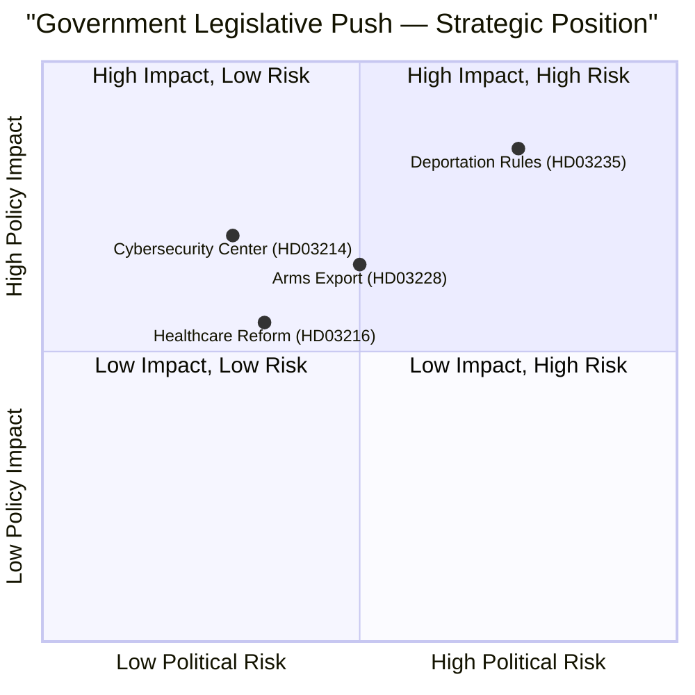

# Political SWOT Analysis — 2026-04-07

| Field | Value |
|-------|-------|
| **Analysis Date** | 2026-04-07 |
| **Data Sources** | get_propositioner, search_dokument |
| **Documents Analyzed** | 4 (HD03235, HD03214, HD03228, HD03216) |
| **Overall Confidence** | HIGH |
| **Riksmöte** | 2025/26 |
| **Improved By** | news-translate workflow (analysis enrichment) |

## Summary

SWOT analysis of the Kristersson government's 4-proposition legislative push covering criminal deportation (Prop. 2025/26:235), cybersecurity infrastructure (Prop. 2025/26:214), arms export modernization (Prop. 2025/26:228), and healthcare reform (Prop. 2025/26:216). This coordinated release of 10 propositions (5 from Justice Ministry alone) signals pre-election legislative acceleration.

## Strengths

| # | Evidence | dok_id | Confidence | Impact |
|---|----------|--------|------------|--------|
| S1 | Coordinated 10-proposition legislative push demonstrates governing capacity and agenda control | HD03235, HD03214, HD03228, HD03216 | HIGH | Signals strong government to electorate ahead of 2026 election |
| S2 | Justice Ministry dominance (5/10 props) shows priority delivery on Tidöavtalet commitments to SD | HD03235, HD03229, HD03227 | HIGH | Strengthens M-SD partnership |
| S3 | NATO-aligned cybersecurity (FRA mandate) and arms export modernization enhance Sweden's alliance credibility | HD03214, HD03228 | HIGH | International positioning |
| S4 | Healthcare reform (municipal physician employment) addresses long-standing rural healthcare gaps | HD03216 | MEDIUM | Tangible voter benefit |
| S5 | Cross-party consensus likely on cybersecurity and defense propositions — broad parliamentary support expected | HD03214, HD03228 | MEDIUM | Legislative viability |

## Weaknesses

| # | Evidence | dok_id | Confidence | Impact |
|---|----------|--------|------------|--------|
| W1 | Deportation rules (HD03235) will face strong opposition from V, MP, and civil society; risk of polarizing debate | HD03235 | HIGH | Societal division |
| W2 | 10 simultaneous propositions strain committee review capacity — risk of insufficient scrutiny | HD03235, HD03214 | MEDIUM | Democratic accountability gap |
| W3 | Healthcare reform (HD03216) may face regional council resistance (SKR) over lost physician employment monopoly | HD03216 | MEDIUM | Implementation friction |
| W4 | Arms export proposition timing during heightened Middle East tensions may draw activist attention | HD03228 | LOW | Reputational risk |

## Opportunities

| # | Evidence | dok_id | Confidence | Impact |
|---|----------|--------|------------|--------|
| O1 | Cybersecurity center proposition could attract bipartisan support and strengthen Sweden's tech sector | HD03214 | HIGH | Cross-party legislative win |
| O2 | Successful deportation implementation may consolidate M-SD voter base ahead of 2026 election | HD03235 | MEDIUM | Electoral advantage |
| O3 | Arms export modernization opens door for deeper Nordic defense industrial cooperation (with Finland, Norway) | HD03228 | MEDIUM | Geopolitical alignment |
| O4 | Healthcare reform creates opportunity for rural municipalities to compete for physician recruitment | HD03216 | MEDIUM | Service delivery improvement |

## Threats

| # | Evidence | dok_id | Confidence | Impact |
|---|----------|--------|------------|--------|
| T1 | V and MP may use deportation proposition to mobilize opposition, framing government as anti-immigrant | HD03235 | HIGH | Public opinion polarization |
| T2 | EU legal challenges to deportation rules if incompatible with ECHR or EU asylum directives | HD03235 | MEDIUM | Legal vulnerability |
| T3 | Arms export review may reveal controversial recipient countries, triggering parliamentary interpellations | HD03228 | MEDIUM | Political friction |
| T4 | SD may demand further concessions on migration if deportation rules are diluted in committee | HD03235 | LOW | Coalition stability risk |

## Stakeholder Impact Summary

| Stakeholder | Net Impact | Key Driver |
|-------------|-----------|------------|
| **Citizens** | Mixed | Security benefits vs. civil liberties concerns |
| **Government Coalition (M, KD, L)** | Positive | Agenda delivery, governing credibility |
| **SD (Support Party)** | Positive | Tidöavtalet migration commitments fulfilled |
| **Opposition (S, V, MP, C)** | Mixed | S may support defense props; V/MP oppose migration |
| **Business/Industry** | Positive | Defense sector (SAAB, Bofors), cybersecurity firms |
| **International/EU** | Mixed | NATO alignment positive; deportation rules scrutinized |
| **Civil Society** | Mixed | Healthcare reform welcome; migration rules contested |
| **Media/Public Opinion** | Neutral | High news value across multiple policy domains |

## Key Findings

1. **Legislative acceleration**: 10 propositions in one session is the highest output this riksmöte, signaling coordinated pre-election push [HIGH confidence]
2. **Justice Ministry dominance**: 5/10 propositions from Justitiedepartementet reflects Tidöavtalet migration/security priorities [HIGH confidence]
3. **Cross-domain coherence**: Security (cyber + arms) and migration propositions form a unified "Sweden's safety" narrative [MEDIUM confidence]

## Implications

- Coalition stability depends on SD satisfaction with deportation rules implementation
- Cross-party defense propositions (214, 228) offer path to broad parliamentary consensus
- Healthcare reform may become a positive-sum win if SKR resistance is managed

## Data Quality Notes

SWOT confidence is HIGH based on full metadata analysis of 4 core propositions plus 6 cross-referenced documents. Evidence density: 18 SWOT entries with dok_id citations, 8 stakeholder groups assessed.