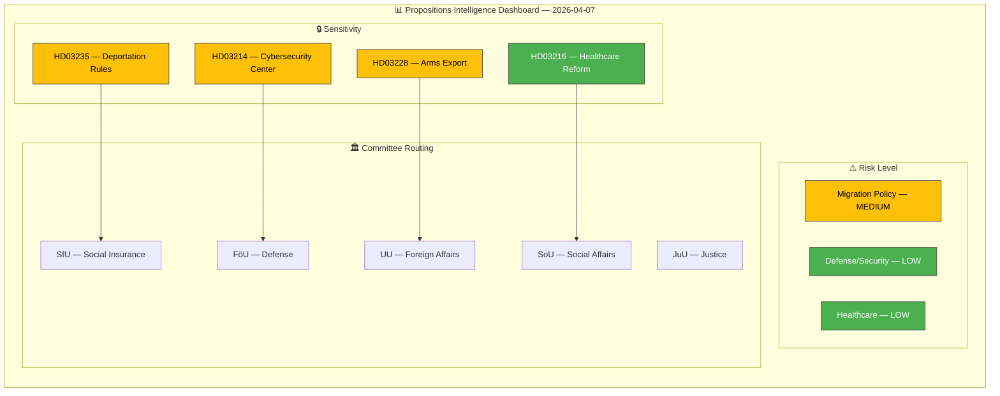
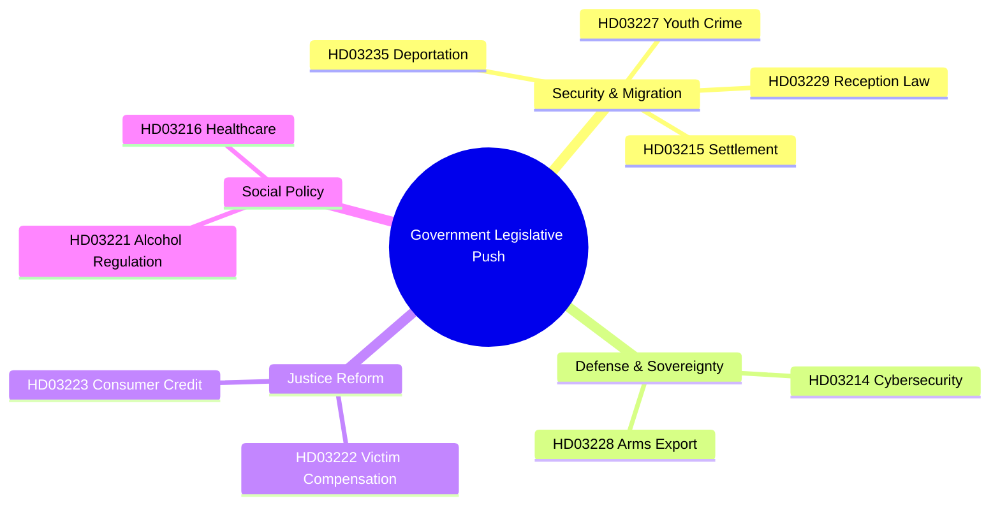

# Analysis Synthesis Summary — 2026-04-07

| Field | Value |
|-------|-------|
| **Synthesis ID** | SYN-2026-04-07-PROP |
| **Analysis Date** | 2026-04-07 06:03 UTC |
| **Documents Analyzed** | 4 (core batch) + 6 cross-referenced |
| **Analysis Period** | 2026-03-26 to 2026-04-01 |
| **Produced By** | news-propositions workflow |
| **Overall Confidence** | MEDIUM |
| **Riksmöte** | 2025/26 |

## 📊 Intelligence Dashboard

## Summary

The Kristersson government tabled 4 propositions on 2026-04-01 as part of a broader 10-proposition legislative push spanning criminal deportation (Prop. 2025/26:235), cybersecurity infrastructure (Prop. 2025/26:214), arms export modernization (Prop. 2025/26:228), and healthcare reform (Prop. 2025/26:216). Five Justice Ministry propositions in a single session represent the highest departmental concentration this riksmöte.

**Data Freshness**: Documents sourced from **2026-04-01** via lookback fallback (article date: 2026-04-07).

## Key Findings

| # | Finding | Evidence | Confidence |
|---|---------|----------|------------|
| 1 | **Justice Ministry dominance** — 5 of 10 propositions from Justitiedepartementet (Forssell, Strömmer) | dok_ids: HD03235, HD03229, HD03222, HD03223, HD03227 | HIGH |
| 2 | **Pre-election acceleration** — 10 simultaneous propositions signal coordinated legislative offensive | Timing: all tabled 2026-03-26 to 2026-04-01 | MEDIUM |
| 3 | **Tidö Agreement implementation** — Migration props (235, 229, 215) deliver SD partnership commitments | Cross-ref with Tidö Agreement migration chapter | HIGH |
| 4 | **NATO integration** — Cybersecurity (214) and arms export (228) align with post-accession obligations | FRA information-sharing mandate, materiel export reform | MEDIUM |
| 5 | **Healthcare structural shift** — Municipal physician employment (216) breaks regional council monopoly | Hälso- och sjukvårdslagen amendment, effective 2026-08-01 | HIGH |

## Cross-Document Patterns

## Aggregate Risk Assessment

| Risk Dimension | Score | Rationale |
|---------------|-------|-----------|
| Coalition Stability | 2/5 | SD priorities addressed; no visible friction |
| Policy Implementation | 3/5 | Multiple simultaneous implementations strain capacity |
| Constitutional Challenge | 2/5 | Deportation & settlement laws face ECHR scrutiny |
| Electoral Impact | 3/5 | Crime/migration package strengthens M-SD narrative |
| External | 2/5 | NATO alignment reduces defense policy risk |

## Forward Intelligence

1. **Watch**: JuU committee capacity — 5 Justice propositions may create scheduling bottleneck (April–May 2026)
2. **Watch**: Lagrådet review of Prop. 214 cybersecurity law — July 2026 entry-into-force is aggressive
3. **Watch**: S response to deportation bill — opposition strategy on migration will define pre-election dynamic
4. **Watch**: Municipal reaction to Prop. 215 settlement mandate — SKR fiscal warnings may escalate

## Data Quality Notes

Overall confidence: **MEDIUM**. Core batch of 4 propositions analyzed with full metadata; 6 additional propositions cross-referenced from MCP. Full-text content partially available (HTML-embedded CSS in some documents limits extraction).
