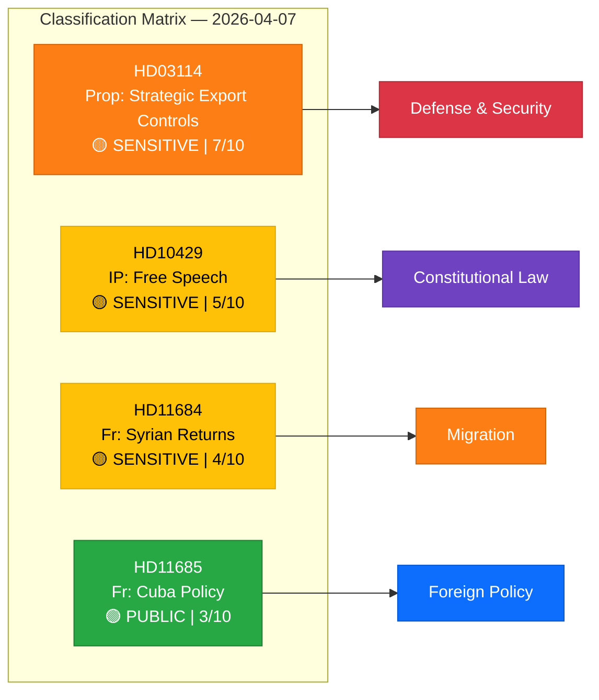

# 🏷️ Political Classification Results — 2026-04-07

## 📋 Context

| Field | Value |
|-------|-------|
| **Analysis Date** | 2026-04-07 10:28 UTC |
| **Documents Analyzed** | 4 |
| **Produced By** | news-realtime-monitor |
| **Overall Confidence** | MEDIUM |

---

## 📊 Classification Overview

---

## 📋 Detailed Classification

### HD03114 — Strategisk exportkontroll 2025

| Field | Value |
|-------|-------|
| **Type** | Proposition (Prop. 2025/26:114) |
| **Sensitivity** | 🟡 SENSITIVE |
| **Significance** | 7/10 |
| **Primary Domain** | Defense & Security |
| **Secondary Domains** | Foreign Policy, Trade & Industry |
| **Urgency** | 🟠 URGENT |
| **Confidence** | HIGH |

### HD10429 — Yttrandefrihet vs Prop 133

| Field | Value |
|-------|-------|
| **Type** | Interpellation (IP 2025/26:429) |
| **Sensitivity** | 🟡 SENSITIVE |
| **Significance** | 5/10 |
| **Primary Domain** | Constitutional Law |
| **Secondary Domain** | Criminal Justice |
| **Urgency** | 🟠 URGENT |
| **Confidence** | MEDIUM |

### HD11684 — Återvändande av syrier

| Field | Value |
|-------|-------|
| **Type** | Written Question (Fråga 2025/26:684) |
| **Sensitivity** | 🟡 SENSITIVE |
| **Significance** | 4/10 |
| **Primary Domain** | Migration & Integration |
| **Urgency** | 🔵 ELEVATED |
| **Confidence** | MEDIUM |

### HD11685 — Kubapolitik med USA

| Field | Value |
|-------|-------|
| **Type** | Written Question (Fråga 2025/26:685) |
| **Sensitivity** | 🟢 PUBLIC |
| **Significance** | 3/10 |
| **Primary Domain** | Foreign Policy |
| **Urgency** | ⚪ ROUTINE |
| **Confidence** | MEDIUM |

---

## 📋 Data Quality Notes

Classification confidence: MEDIUM. Document types identified from MCP metadata. Full-text analysis would refine sensitivity classifications and domain assignment.