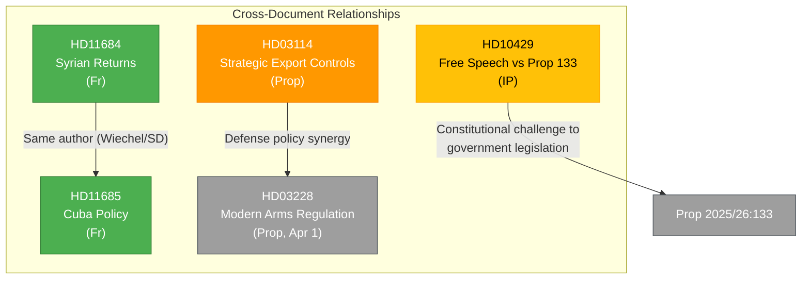

# 🔗 Cross-Reference Map — 2026-04-07

## 📋 Context

| Field | Value |
|-------|-------|
| **Analysis Date** | 2026-04-07 10:28 UTC |
| **Documents Analyzed** | 4 |
| **Produced By** | news-realtime-monitor |
| **Overall Confidence** | MEDIUM |

---

## 📊 Cross-Reference Network

---

## 📋 Relationship Register

| Source | Target | Type | Description |
|--------|--------|------|-------------|
| HD03114 | HD03228 | Policy synergy | Both address arms export regulation; HD03228 modernizes the framework that HD03114 reports on |
| HD11684 | HD11685 | Shared author | Both filed by Markus Wiechel (SD) on same day — coordinated SD foreign policy pressure |
| HD10429 | Prop 2025/26:133 | Legislative reference | Interpellation directly challenges specific government proposition |
| HD03114 | HD11685 | Domain overlap | Both touch foreign policy — arms exports (HD03114) and Cuba relations (HD11685) |

---

## 📋 Data Quality Notes

4 cross-document relationships identified. External references (HD03228, Prop 133) provide additional legislative context. Network would be richer with full-text analysis enabling keyword-based linking.