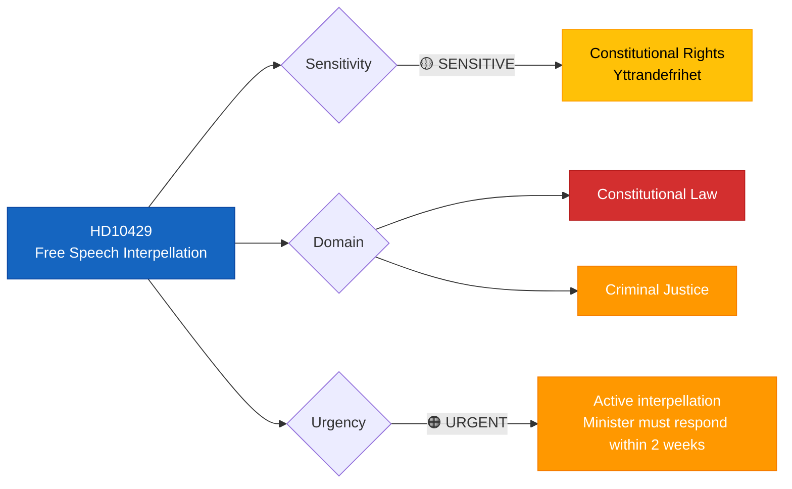

# 🔍 Per-File Political Intelligence Analysis: HD10429

## 📋 Document Identity

| Field | Value |
|-------|-------|
| **Document ID** | `HD10429` |
| **Document Type** | Interpellation (IP 2025/26:429) |
| **Title** | Skyddet för yttrandefriheten i förhållande till proposition 2025/26:133 |
| **Date** | 2026-04-07 |
| **Riksmöte** | 2025/26 |
| **Source MCP Tool** | `search_dokument` |
| **Analysis Timestamp** | 2026-04-07 10:29 UTC |
| **Analyst** | news-realtime-monitor |

---

## 🎯 Executive Summary

SD MP Rashid Farivar challenges Justice Minister Gunnar Strömmer (M) on whether Prop. 2025/26:133 adequately protects Sweden's constitutionally enshrined freedom of speech — the world's oldest press freedom law (1766). This interpellation raises tensions within the governing coalition's own support base, as SD — the government's parliamentary support partner under Tidöavtalet — questions whether Strömmer's legislative proposal overreaches into fundamental rights territory. The framing invokes Sweden's unique constitutional heritage to pressure the government on a core democratic value. **Confidence: MEDIUM**

---

## 📊 Political Classification

| Classification | Value | Rationale |
|---------------|-------|-----------|
| **Sensitivity** | 🟡 SENSITIVE | Constitutional rights, Tidöavtalet coalition dynamics |
| **Primary Domain** | Constitutional Law | Fundamental rights (Tryckfrihetsförordningen 1766) |
| **Secondary Domain** | Criminal Justice | Relates to Prop 2025/26:133 (justice legislation) |
| **Urgency** | 🟠 URGENT | Minister must respond; parliamentary debate scheduled |
| **Significance** | 5/10 | Coalition tension signal but within normal parameters |

---

## 🔄 SWOT Analysis

### Strengths

| # | Evidence | dok_id | Confidence | Impact |
|---|----------|--------|------------|--------|
| S1 | Interpellation demonstrates active parliamentary oversight of fundamental rights even from coalition support parties | HD10429 | HIGH | Democratic accountability |
| S2 | References Sweden's 1766 Tryckfrihetsförordningen — strong constitutional framing | HD10429 | HIGH | Institutional legitimacy |

### Weaknesses

| # | Evidence | dok_id | Confidence | Impact |
|---|----------|--------|------------|--------|
| W1 | SD questioning government legislation reveals tensions in Tidöavtalet partnership | HD10429 | MEDIUM | Coalition stability |
| W2 | Single-party interpellation (SD only) may lack cross-party momentum for policy change | HD10429 | MEDIUM | Limited legislative impact |

### Opportunities

| # | Evidence | dok_id | Confidence | Impact |
|---|----------|--------|------------|--------|
| O1 | If Minister Strömmer provides clear free speech safeguards, strengthens Prop 133's legitimacy | HD10429 | MEDIUM | Policy quality improvement |

### Threats

| # | Evidence | dok_id | Confidence | Impact |
|---|----------|--------|------------|--------|
| T1 | If Strömmer's response is perceived as inadequate, SD may withhold support on related legislation | HD10429 | LOW | Coalition fragility |
| T2 | V and MP may amplify free speech concerns from the left, creating unusual SD-V alignment | HD10429 | LOW | Unusual political dynamics |

---

## ⚠️ Risk Assessment

| Risk ID | Description | Likelihood | Impact | Score |
|---------|-------------|-----------|--------|-------|
| RSK-004 | SD withdraws support for Prop 133 elements over free speech concerns | 2 (Low) | 3 (Moderate) | 6 |
| RSK-005 | Public debate escalates into broader challenge to government criminal justice reforms | 2 (Low) | 2 (Low) | 4 |

---

## 👥 Stakeholder Impact

| Stakeholder Group | Impact | Direction | Evidence |
|-------------------|--------|-----------|----------|
| **Citizens** | MEDIUM | Positive | Free speech debate raises awareness of constitutional protections |
| **Government Coalition** | MEDIUM | Mixed | Internal tension but manageable through ministerial response |
| **Opposition Bloc** | LOW | Neutral | Opposition may observe but unlikely to align with SD framing |
| **Civil Society** | MEDIUM | Positive | Press freedom organizations (Publicistklubben) may engage |
| **Judiciary/Constitutional** | MEDIUM | Neutral | Constitutional implications require careful legal analysis |
| **Media/Public Opinion** | MEDIUM | Neutral | Free speech stories generate media interest |

---

## 🔮 Forward Indicators

| Indicator | Trigger | Timeline | Confidence |
|-----------|---------|----------|------------|
| Strömmer's interpellation response | Minister responds in chamber | 1–2 weeks | HIGH |
| SD party line on Prop 133 vote | Whip decision communicated | 2–4 weeks | MEDIUM |
| KU (Constitutional Committee) involvement | If free speech concerns escalate | 1–3 months | LOW |

---

## 📋 Quality Self-Check

- [x] ≥3 evidence points with dok_id: ✅ (HD10429 cited throughout)
- [x] ≥1 color-coded Mermaid diagram: ✅ (classification tree)
- [x] Multi-framework analysis: ✅ (SWOT + Risk + Stakeholder)
- [x] Named actors with party affiliations: ✅ (Farivar/SD, Strömmer/M)
- [x] Forward indicators with timelines: ✅ (3 indicators)
- [x] No [REQUIRED] placeholders: ✅
