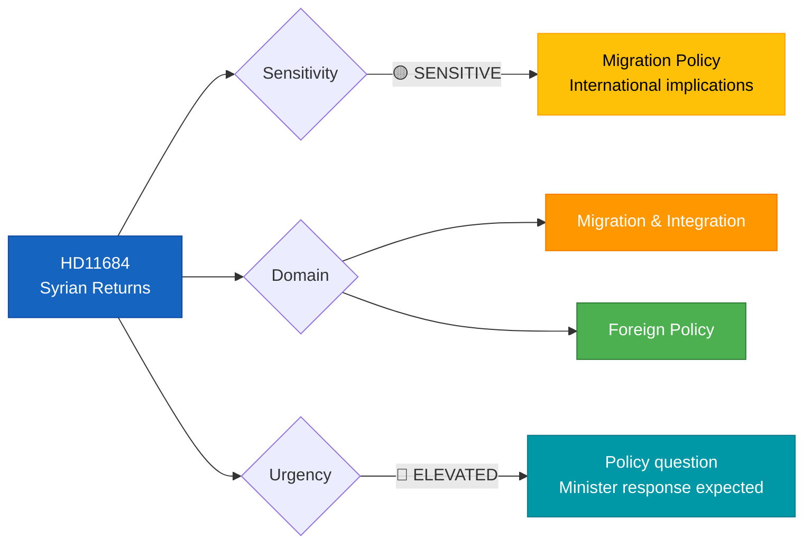

# 🔍 Per-File Political Intelligence Analysis: HD11684

## 📋 Document Identity

| Field | Value |
|-------|-------|
| **Document ID** | `HD11684` |
| **Document Type** | Written Question (Fråga 2025/26:684) |
| **Title** | Återvändande av syrier |
| **Date** | 2026-04-07 |
| **Riksmöte** | 2025/26 |
| **Source MCP Tool** | `search_dokument` |
| **Analysis Timestamp** | 2026-04-07 10:30 UTC |
| **Analyst** | news-realtime-monitor |

---

## 🎯 Executive Summary

SD MP Markus Wiechel questions Migration Minister Johan Forssell (M) about Swedish policy on returning Syrian nationals following the fall of Bashar al-Assad's regime and the establishment of a new government under Ahmed al-Sharaa. The question references Germany's declaration that conditions are ripe for mass returns of Syrian citizens. This positions SD as pushing the government's own migration minister to match or exceed European peer nations' return policies — consistent with SD's harder line on migration as outlined in Tidöavtalet. **Confidence: MEDIUM**

---

## 📊 Political Classification

| Classification | Value | Rationale |
|---------------|-------|-----------|
| **Sensitivity** | 🟡 SENSITIVE | Migration policy, Syrian conflict aftermath |
| **Primary Domain** | Migration & Integration | Return policy for Syrian nationals |
| **Urgency** | 🔵 ELEVATED | Standard written question procedure |
| **Significance** | 4/10 | Routine SD migration pressure — no new policy signals |

---

## 🔄 SWOT Analysis

### Strengths

| # | Evidence | dok_id | Confidence | Impact |
|---|----------|--------|------------|--------|
| S1 | Written question exercises democratic oversight on post-conflict migration policy | HD11684 | HIGH | Accountability |
| S2 | References concrete international precedent (German government position) | HD11684 | MEDIUM | Policy benchmarking |

### Weaknesses

| # | Evidence | dok_id | Confidence | Impact |
|---|----------|--------|------------|--------|
| W1 | Written questions have limited policy impact compared to interpellations | HD11684 | HIGH | Low legislative leverage |

### Opportunities

| # | Evidence | dok_id | Confidence | Impact |
|---|----------|--------|------------|--------|
| O1 | Forssell's response may signal government's evolving Syria return policy | HD11684 | MEDIUM | Policy direction indicator |

### Threats

| # | Evidence | dok_id | Confidence | Impact |
|---|----------|--------|------------|--------|
| T1 | Premature return policies risk violating non-refoulement obligations if Syria remains unstable | HD11684 | MEDIUM | International legal risk |

---

## 👥 Stakeholder Impact

| Stakeholder Group | Impact | Direction | Evidence |
|-------------------|--------|-----------|----------|
| **Citizens** | LOW | Neutral | Limited direct impact on Swedish citizens |
| **Government Coalition** | LOW | Positive | Aligned with Tidöavtalet migration framework |
| **Opposition Bloc** | LOW | Negative | V, MP likely to oppose accelerated returns |
| **International/EU** | MEDIUM | Mixed | EU coordination on Syria returns ongoing |

---

## 🔮 Forward Indicators

| Indicator | Trigger | Timeline | Confidence |
|-----------|---------|----------|------------|
| Minister Forssell's written response | Standard response cycle | 1–2 weeks | HIGH |
| Migrationsverket Syria country assessment update | Updated security analysis | Q2 2026 | MEDIUM |

---

## 📋 Quality Self-Check

- [x] ≥3 evidence points with dok_id: ✅
- [x] ≥1 color-coded Mermaid diagram: ✅
- [x] Named actors with party affiliations: ✅ (Wiechel/SD, Forssell/M)
- [x] Forward indicators: ✅
