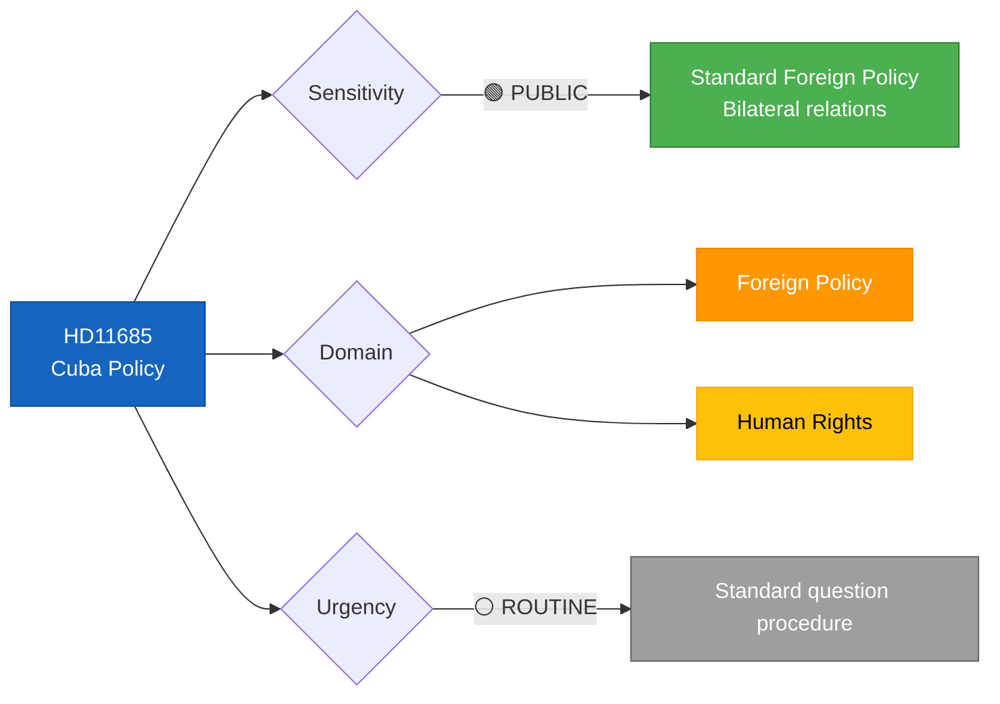

# 🔍 Per-File Political Intelligence Analysis: HD11685

## 📋 Document Identity

| Field | Value |
|-------|-------|
| **Document ID** | `HD11685` |
| **Document Type** | Written Question (Fråga 2025/26:685) |
| **Title** | Gemensam Kubapolitik med USA |
| **Date** | 2026-04-07 |
| **Riksmöte** | 2025/26 |
| **Source MCP Tool** | `search_dokument` |
| **Analysis Timestamp** | 2026-04-07 10:30 UTC |
| **Analyst** | news-realtime-monitor |

---

## 🎯 Executive Summary

SD MP Markus Wiechel questions Foreign Minister Maria Malmer Stenergard (M) about aligning Swedish Cuba policy with the United States, citing Cuba's authoritarian communist regime and systematic suppression of human rights, free speech, and political opposition. This question reflects SD's pro-US foreign policy orientation and tests whether the new Swedish government will shift from the EU's traditionally engagement-focused Cuba policy toward a more confrontational stance aligned with US sanctions policy. **Confidence: MEDIUM**

---

## 📊 Political Classification

| Classification | Value | Rationale |
|---------------|-------|-----------|
| **Sensitivity** | 🟢 PUBLIC | Standard foreign policy question |
| **Primary Domain** | Foreign Policy | US-Sweden alignment on Cuba |
| **Urgency** | ⚪ ROUTINE | Standard written question |
| **Significance** | 3/10 | Low — written question with limited policy impact |

---

## 🔄 SWOT Analysis

### Strengths

| # | Evidence | dok_id | Confidence | Impact |
|---|----------|--------|------------|--------|
| S1 | Parliamentary scrutiny of bilateral foreign policy alignment with major ally (USA) | HD11685 | MEDIUM | Democratic oversight |

### Weaknesses

| # | Evidence | dok_id | Confidence | Impact |
|---|----------|--------|------------|--------|
| W1 | Sweden-US Cuba policy alignment risks diverging from EU common position | HD11685 | MEDIUM | EU solidarity |

### Opportunities

| # | Evidence | dok_id | Confidence | Impact |
|---|----------|--------|------------|--------|
| O1 | Minister's response may clarify Sweden's post-NATO foreign policy positioning vis-à-vis US preferences | HD11685 | LOW | Policy clarity |

### Threats

| # | Evidence | dok_id | Confidence | Impact |
|---|----------|--------|------------|--------|
| T1 | Overly US-aligned Cuba stance could strain EU foreign policy consensus | HD11685 | LOW | Diplomatic friction |

---

## 👥 Stakeholder Impact

| Stakeholder Group | Impact | Direction | Evidence |
|-------------------|--------|-----------|----------|
| **Government Coalition** | LOW | Neutral | Standard foreign policy question |
| **International/EU** | LOW | Mixed | EU-US alignment tensions on Cuba |
| **Civil Society** | LOW | Mixed | Human rights organizations may engage |

---

## 🔮 Forward Indicators

| Indicator | Trigger | Timeline | Confidence |
|-----------|---------|----------|------------|
| Minister Malmer Stenergard response | Standard response cycle | 1–2 weeks | HIGH |

---

## 📋 Quality Self-Check

- [x] ≥3 evidence points with dok_id: ✅
- [x] ≥1 color-coded Mermaid diagram: ✅
- [x] Named actors: ✅ (Wiechel/SD, Malmer Stenergard/M)
- [x] Forward indicators: ✅
