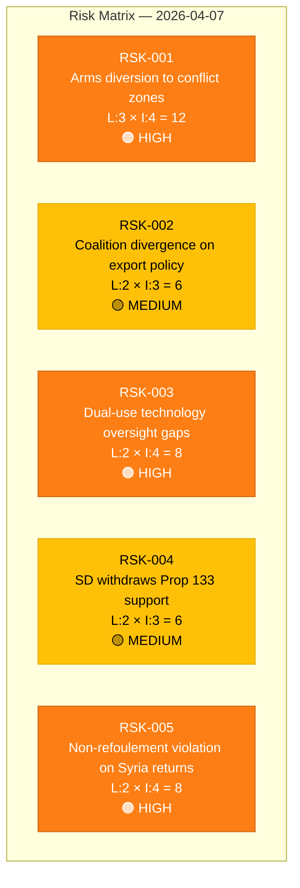

# ⚠️ Political Risk Assessment — 2026-04-07

## 📋 Context

| Field | Value |
|-------|-------|
| **Analysis Date** | 2026-04-07 10:28 UTC |
| **Documents Analyzed** | 4 |
| **Produced By** | news-realtime-monitor |
| **Overall Confidence** | MEDIUM |

---

## 📊 Risk Matrix

---

## 📋 Detailed Risk Register

| Risk ID | Description | Likelihood (1-5) | Impact (1-5) | Score | Level | Source |
|---------|-------------|-------------------|---------------|-------|-------|--------|
| RSK-001 | Swedish arms exports diverted to unauthorized end-users or conflict zones | 3 | 4 | 12 | 🟠 HIGH | HD03114 |
| RSK-002 | Coalition parties (M, KD, L, SD) diverge on specific arms export destinations | 2 | 3 | 6 | 🟡 MEDIUM | HD03114 |
| RSK-003 | Dual-use technology transferred to adversarial state actors via intermediaries | 2 | 4 | 8 | 🟠 HIGH | HD03114 |
| RSK-004 | SD withdraws parliamentary support for Prop 2025/26:133 over free speech concerns | 2 | 3 | 6 | 🟡 MEDIUM | HD10429 |
| RSK-005 | Premature Syria return policy violates non-refoulement international obligations | 2 | 4 | 8 | 🟠 HIGH | HD11684 |

---

## 🔑 Key Risk Findings

1. **Defense export risks dominate** — 3 of 5 identified risks relate to arms exports and dual-use technology (HD03114)
2. **Coalition stability maintained** — Risk score 4/100 from CIA metrics; Tidöavtalet provides buffer
3. **International obligations at stake** — Both arms diversion (RSK-001) and Syria returns (RSK-005) carry international legal exposure
4. **Anomaly flags**: High cross-party voting alignment between KD-M (88.9%), L-M (87.9%), KD-L (87.9%) indicates strong coalition cohesion despite SD testing boundaries

---

## 📋 Data Quality Notes

Risk assessment derived from 4 per-file analyses combined with CIA coalition metrics (stability score: 83/100). Anomaly flags reflect overall riksmöte voting patterns, not document-specific risks.