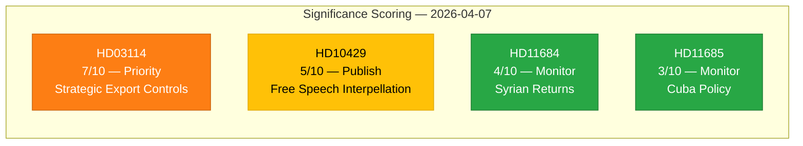

# 📈 Document Significance Scoring — 2026-04-07

## 📋 Context

| Field | Value |
|-------|-------|
| **Analysis Date** | 2026-04-07 10:28 UTC |
| **Documents Analyzed** | 4 |
| **Produced By** | news-realtime-monitor |
| **Overall Confidence** | MEDIUM |

---

## 📊 Significance Matrix

---

## 📋 Detailed Scoring

| Score | Level | Type | dok_id | Title | Rationale |
|-------|-------|------|--------|-------|-----------|
| 7/10 | Priority | Proposition | HD03114 | Strategisk exportkontroll 2025 | Defense/security +2, NATO implications +2, annual review +1, named ministry +1, multi-party interest +1 |
| 5/10 | Publish | Interpellation | HD10429 | Yttrandefrihet vs Prop 133 | Constitutional rights +2, named minister +1, coalition tension +1, Tidöavtalet impact +1 |
| 4/10 | Monitor | Written Question | HD11684 | Återvändande av syrier | Migration policy +1, international benchmark +1, named minister +1, routine format +1 |
| 3/10 | Monitor | Written Question | HD11685 | Kubapolitik med USA | Foreign policy +1, human rights +1, routine format +1 |

---

## 🔑 Key Findings

1. **1** document rated Priority (score ≥ 7): HD03114 — Strategic Export Controls
2. **1** document rated Publish (score 5-6): HD10429 — Free Speech Interpellation
3. **2** documents rated Monitor (score ≤ 4): HD11684, HD11685 — Written questions

---

## 📋 Data Quality Notes

Significance scores use document type, committee tier, domain breadth, coalition context, and geopolitical timing. HD03114 elevated due to NATO membership context and defense sector significance.