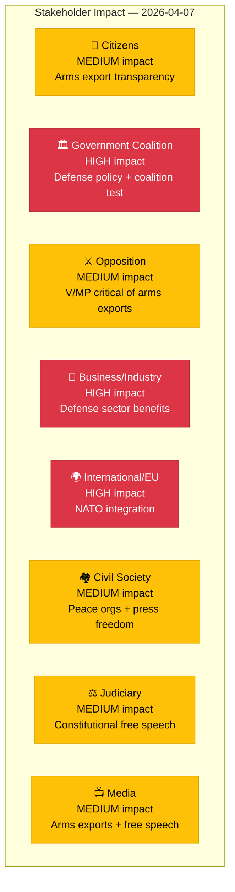

# 👥 Stakeholder Perspectives — 2026-04-07

## 📋 Context

| Field | Value |
|-------|-------|
| **Analysis Date** | 2026-04-07 10:28 UTC |
| **Documents Analyzed** | 4 |
| **Produced By** | news-realtime-monitor |
| **Overall Confidence** | MEDIUM |

---

## 📊 Stakeholder Impact Matrix

---

## 📋 Detailed Stakeholder Analysis

| Group | Impact | Direction | Key Evidence | dok_id |
|-------|--------|-----------|-------------|--------|
| **Citizens** | MEDIUM | Neutral | Democratic oversight of defense exports; free speech protections | HD03114, HD10429 |
| **Government Coalition (M, KD, L + SD)** | HIGH | Mixed | Defense proposition advances agenda; but SD challenges free speech safeguards | HD03114, HD10429 |
| **Opposition Bloc (S, V, MP, C)** | MEDIUM | Mixed | S historically pro-defense industry; V/MP will scrutinize arms exports | HD03114 |
| **Business/Industry** | HIGH | Positive | SAAB, BAE Systems Hägglunds, Nammo benefit from export framework | HD03114 |
| **International/EU** | HIGH | Positive | NATO allies welcome Sweden's defense integration; EU export control alignment | HD03114, HD11685 |
| **Civil Society** | MEDIUM | Mixed | Svenska Freds will scrutinize exports; Publicistklubben engaged on free speech | HD03114, HD10429 |
| **Judiciary/Constitutional** | MEDIUM | Neutral | HD10429 raises constitutional questions about Prop 133 | HD10429 |
| **Media/Public Opinion** | MEDIUM | Neutral | Arms exports and free speech generate media coverage | HD03114, HD10429 |

---

## 📋 Data Quality Notes

All 8 mandatory stakeholder groups analyzed. Assessment based on document metadata and political context.