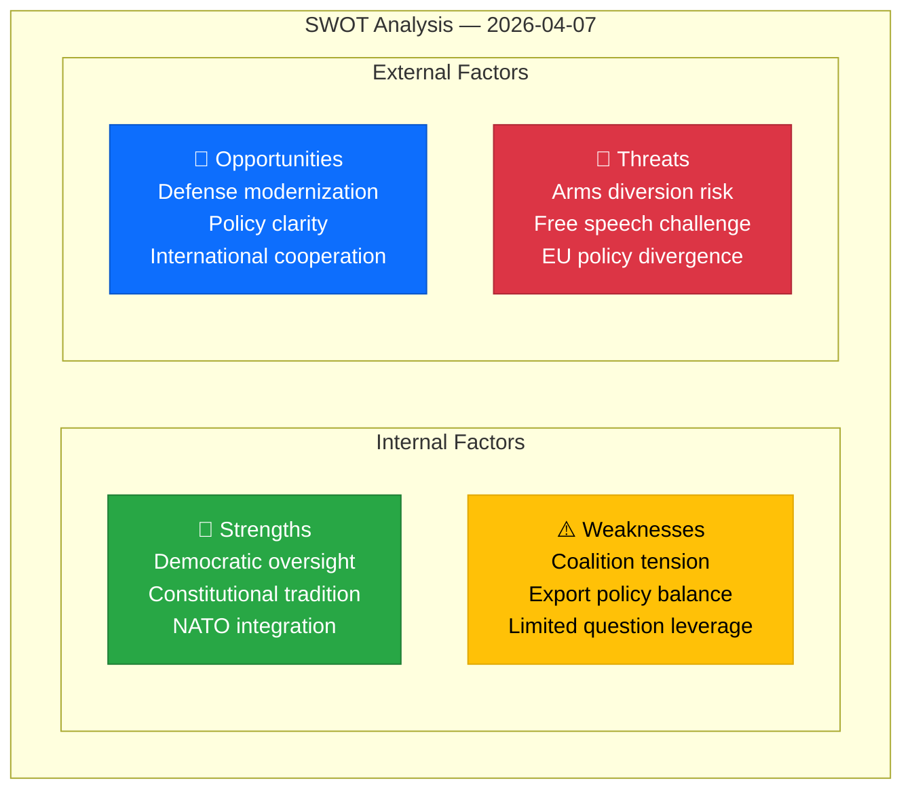

# ⚖️ Political SWOT Analysis — 2026-04-07

## 📋 Context

| Field | Value |
|-------|-------|
| **Analysis Date** | 2026-04-07 10:28 UTC |
| **Documents Analyzed** | 4 |
| **Produced By** | news-realtime-monitor |
| **Overall Confidence** | MEDIUM |

---

## 📊 SWOT Quadrant Mapping

---

## 💪 Strengths

| # | Finding | Evidence | dok_id | Confidence | Impact |
|---|---------|----------|--------|------------|--------|
| S1 | Annual strategic export review demonstrates Sweden's commitment to transparent defense policy governance | Government proposition on war materiel exports | HD03114 | HIGH | Institutional credibility |
| S2 | Parliamentary oversight of fundamental rights active even from coalition support parties | SD interpellation on free speech protections | HD10429 | HIGH | Democratic accountability |
| S3 | NATO membership provides enhanced framework for defense industrial cooperation | Strategic export controls in NATO context | HD03114 | HIGH | Economic and security benefits |
| S4 | Active use of parliamentary instruments (3 SD initiatives in one day) shows healthy democratic debate | Written questions and interpellation | HD11684, HD11685, HD10429 | MEDIUM | Parliamentary vitality |

## ⚠️ Weaknesses

| # | Finding | Evidence | dok_id | Confidence | Impact |
|---|---------|----------|--------|------------|--------|
| W1 | Tension between Swedish arms export restraint tradition and NATO alliance expectations | Export control proposition navigates competing pressures | HD03114 | HIGH | Policy coherence risk |
| W2 | SD questioning government's own legislation reveals Tidöavtalet stress points | Interpellation on Prop 133 from support party | HD10429 | MEDIUM | Coalition stability |
| W3 | Written questions have limited policy impact — signals intent without legislative force | Routine parliamentary instruments | HD11684, HD11685 | HIGH | Limited policy change |

## 🎯 Opportunities

| # | Finding | Evidence | dok_id | Confidence | Impact |
|---|---------|----------|--------|------------|--------|
| O1 | Modernization of arms export framework (Prop 228) creates synergy with annual review | Parallel legislative tracks in defense policy | HD03114, HD03228 | HIGH | Regulatory improvement |
| O2 | Free speech debate may strengthen Prop 133's safeguards through parliamentary scrutiny | Constitutional dialogue between SD and M | HD10429 | MEDIUM | Policy quality |
| O3 | Germany's Syria return position provides policy benchmarking for Swedish migration reform | International comparison on return policy | HD11684 | MEDIUM | Evidence-based policy |

## 🔴 Threats

| # | Finding | Evidence | dok_id | Confidence | Impact |
|---|---------|----------|--------|------------|--------|
| T1 | Risk of Swedish arms being diverted to conflict zones despite export controls | Annual report must demonstrate due diligence | HD03114 | HIGH | International reputation |
| T2 | If free speech concerns escalate, may destabilize broader Tidöavtalet cooperation | SD challenging M minister on constitutional grounds | HD10429 | LOW | Coalition fragility |
| T3 | Aligning Cuba policy with US risks diverging from EU common foreign policy position | Sweden-US-EU triangulation | HD11685 | LOW | Diplomatic friction |

---

## 📋 Data Quality Notes

SWOT analysis aggregated from 4 per-file analyses. Confidence is MEDIUM due to metadata-only analysis (full-text would elevate to HIGH). Cross-references to Prop 2025/26:228 and Prop 2025/26:133 included.