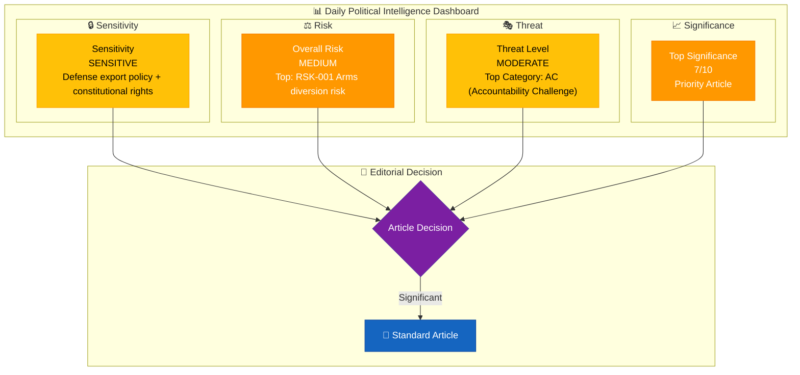
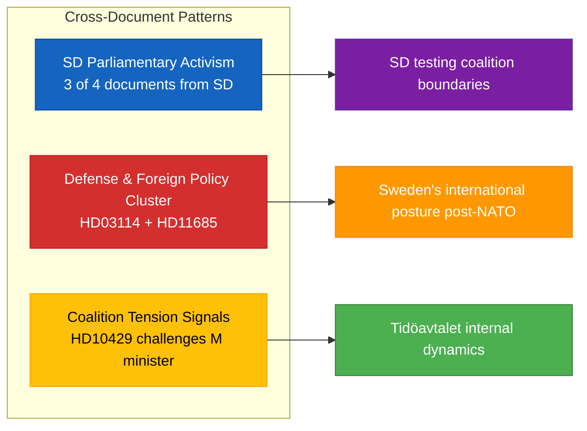

# 🧩 Political Intelligence Synthesis — 2026-04-07

## 📋 Synthesis Context

| Field | Value |
|-------|-------|
| **Synthesis ID** | SYN-2026-04-07-1026 |
| **Analysis Date** | 2026-04-07 10:28 UTC |
| **Documents Analyzed** | 4 |
| **Analysis Period** | 2026-04-06 00:00 – 2026-04-07 12:00 UTC |
| **Produced By** | news-realtime-monitor |
| **Overall Confidence** | MEDIUM |
| **Data Freshness** | Documents sourced from **2026-04-07** |

---

## 📊 Intelligence Dashboard

---

## 🔑 Key Findings

### 1. Strategic Export Controls Dominate — Defense Policy in Focus (HD03114)
The government's annual strategic export control proposition (Prop. 2025/26:114) is the most significant document today. Published by Utrikesdepartementet, it reviews Sweden's 2025 arms exports and dual-use technology transfers. In the context of Sweden's second year of NATO membership, this report carries elevated geopolitical significance as Sweden balances traditional arms export restraint with NATO alliance obligations.

### 2. Free Speech Tension Within Coalition (HD10429)
SD MP Rashid Farivar's interpellation to Justice Minister Gunnar Strömmer (M) signals intra-coalition friction over Prop 2025/26:133. The question invokes Sweden's 1766 Tryckfrihetsförordningen (world's first press freedom law) to frame concerns about government overreach — notable because SD is the government's own parliamentary support partner under Tidöavtalet.

### 3. SD Foreign Policy Activism (HD11684, HD11685)
Two written questions from Markus Wiechel (SD) — on Syrian returns and Cuba policy — reflect SD's sustained pressure on the government's foreign and migration policy from a pro-US, restrictive migration stance. Germany's Syria return declaration provides external policy benchmarking.

---

## 📊 Cross-Document Pattern Analysis

**Key pattern**: 3 of 4 documents today originate from SD, reflecting the party's active use of parliamentary instruments (interpellation, written questions) to shape government policy from outside the cabinet. This is consistent with SD's Tidöavtalet role as external support party.

---

## 📈 Document Significance Ranking

| Rank | Score | Type | dok_id | Title | Rationale |
|------|-------|------|--------|-------|-----------|
| 1 | 7/10 | Proposition | HD03114 | Strategisk exportkontroll 2025 | Defense policy, NATO implications, annual review |
| 2 | 5/10 | Interpellation | HD10429 | Yttrandefrihet vs Prop 133 | Constitutional rights, coalition tension |
| 3 | 4/10 | Written Question | HD11684 | Återvändande av syrier | Migration policy, international comparison |
| 4 | 3/10 | Written Question | HD11685 | Kubapolitik med USA | Foreign policy, routine question |

---

## 🔮 Forward Intelligence

| Watch Item | Trigger | Timeline | Confidence |
|-----------|---------|----------|------------|
| UU committee hearing on HD03114 | Proposition assigned to Foreign Affairs Committee | 1–3 weeks | HIGH |
| Strömmer response to HD10429 interpellation | Ministerial response deadline | 1–2 weeks | HIGH |
| SD motion volume on defense/foreign policy | Spring motion period pattern | 2–6 weeks | MEDIUM |
| Arms export data publication by ISP | Annual statistics release | Q3 2026 | HIGH |

---

## 📋 Data Quality Notes

Overall confidence: **MEDIUM**. Four documents analyzed with metadata and summaries; full-text analysis would increase confidence to HIGH. Analysis integrates cross-references to Prop 2025/26:228 (modern arms framework) and Prop 2025/26:133 (justice legislation). Coalition dynamics assessed using Tidöavtalet framework.