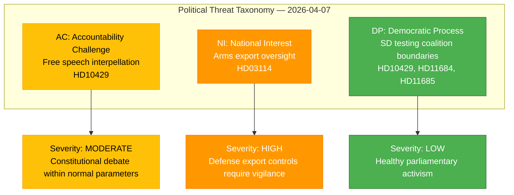

# 🔴 Political Threat Analysis — 2026-04-07

## 📋 Context

| Field | Value |
|-------|-------|
| **Analysis Date** | 2026-04-07 10:28 UTC |
| **Documents Analyzed** | 4 |
| **Produced By** | news-realtime-monitor |
| **Overall Confidence** | MEDIUM |

---

## 📊 Threat Taxonomy

---

## 📋 Threat Register

| ID | Category | Description | Severity | Source | Target |
|----|----------|-------------|----------|--------|--------|
| THR-001 | NI (National Interest) | Arms diversion risk in Swedish export control framework | HIGH | HD03114 | International reputation, defense industry |
| THR-002 | AC (Accountability Challenge) | SD challenges Justice Minister on constitutional free speech protections | MODERATE | HD10429 | Government Prop 133 legislative program |
| THR-003 | DP (Democratic Process) | SD testing Tidöavtalet boundaries through parallel parliamentary instruments | LOW | HD10429, HD11684, HD11685 | Coalition stability |

---

## 🔑 Key Findings

1. **3 threat indicators identified** targeting 3 stakeholder groups (defense industry, government legislative program, coalition stability)
2. **NI category dominates** — national interest threats from defense export oversight most significant
3. **AC threats manageable** — SD's free speech challenge is within normal parliamentary bounds
4. **DP threats minimal** — SD parliamentary activism reflects healthy democratic engagement, not coalition crisis

---

## 📋 Data Quality Notes

Threat analysis confidence: MEDIUM. Assessment based on document metadata and summaries. Full-text analysis of Prop 2025/26:133 would clarify severity of THR-002.