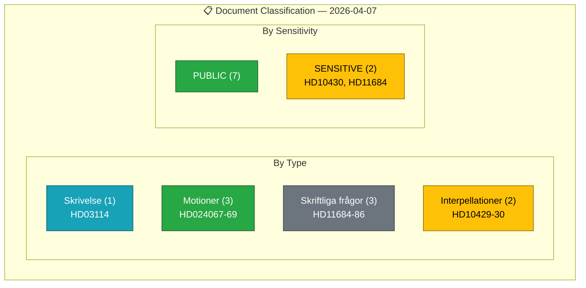

# Political Classification Results — 2026-04-07

| Field | Value |
|-------|-------|
| **Classification ID** | `CLS-2026-04-07-1411` |
| **Analysis Date** | 2026-04-07 14:11 UTC |
| **Documents Classified** | 9 |
| **Overall Confidence** | MEDIUM |
| **Produced By** | news-realtime-monitor (AI-enriched) |

## Classification Summary

## Detailed Classification

| dok_id | Title | Type | Sensitivity | Urgency | Impact | Policy Domain |
|--------|-------|------|:-----------:|:-------:|:------:|--------------|
| HD03114 | Strategisk exportkontroll 2025 | skr | PUBLIC | LOW | MEDIUM | Defense/Security |
| HD024067 | Kommunala hyresgarantier (MP mot) | mot | PUBLIC | LOW | LOW | Housing |
| HD024068 | Förenklingar i jaktlagstiftningen (MP mot) | mot | PUBLIC | LOW | LOW | Environment |
| HD024069 | Beredskapslager i livsmedelskedjan (MP mot) | mot | PUBLIC | LOW | LOW | Food Security |
| HD11684 | Återvändande av syrier (SD fr) | fr | SENSITIVE | LOW | LOW | Migration |
| HD11685 | Gemensam Kubapolitik med USA (SD fr) | fr | PUBLIC | LOW | LOW | Foreign Policy |
| HD11686 | Myndighetschefen för Uppsala universitet (SD fr) | fr | PUBLIC | LOW | LOW | Education |
| HD10429 | Skyddet för yttrandefriheten (SD ip) | ip | PUBLIC | LOW | MEDIUM | Constitutional |
| HD10430 | Moskéer som sprider hat och hot (SD ip) | ip | SENSITIVE | MEDIUM | MEDIUM | Integration |

## Key Findings

1. Document mix dominated by SD parliamentary questions (5 of 9) — reflects support partner oversight activity
2. Two documents classified as SENSITIVE: mosque interpellation (HD10430) and Syrian returnees question (HD11684)
3. Only 1 government-authored document (HD03114 skrivelse) — rest are opposition/support partner activity
