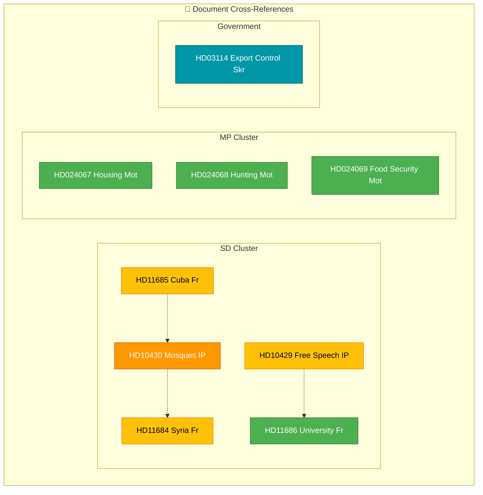

# Cross-Reference Map — 2026-04-07

| Field | Value |
|-------|-------|
| **Cross-Ref ID** | `XRF-2026-04-07-1411` |
| **Analysis Date** | 2026-04-07 14:11 UTC |
| **Documents Mapped** | 9 |
| **Overall Confidence** | MEDIUM |
| **Produced By** | news-realtime-monitor (AI-enriched) |

## Cross-Reference Network

## Cross-Reference Table

| Source dok_id | Target dok_id | Relationship | Confidence |
|--------------|--------------|-------------|:----------:|
| HD10430 | HD11684 | SD integration policy cluster (mosque + Syrian returnees) | M |
| HD10429 | HD11686 | Constitutional/academic freedom thematic overlap | L |
| HD11685 | HD10430 | SD foreign policy + domestic integration connection | L |
| HD024067 | Prop 2025/26:212 | Direct counter-motion to government proposition | H |
| HD024068 | Prop 2025/26:211 | Direct counter-motion to government proposition | H |
| HD024069 | Prop 2025/26:205 | Direct counter-motion to government proposition | H |

## Key Findings

1. **SD cluster**: 5 documents from SD form two sub-clusters — integration (HD10430, HD11684) and constitutional/academic freedom (HD10429, HD11686)
2. **MP cluster**: 3 motions are direct responses to 3 different government propositions — standard parliamentary procedure
3. **No cross-party connections**: SD and MP documents address unrelated policy areas
