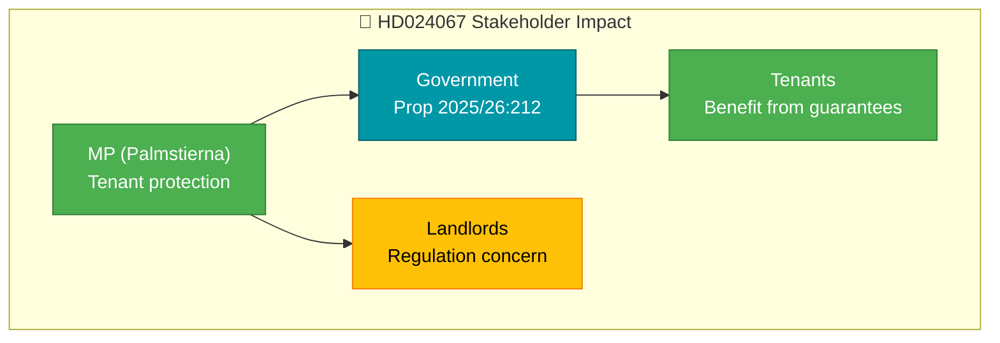

# Document Analysis: Kommunala hyresgarantier

| Field | Value |
|-------|-------|
| **dok_id** | HD024067 |
| **Document Type** | Motion |
| **Date** | 2026-04-07 |
| **Author** | Amanda Palmstierna m.fl. (MP) |
| **Committee** | CU |
| **Riksmöte** | 2025/26 |
| **Related Proposition** | Prop 2025/26:212 |
| **Significance** | 1/10 — LOW |
| **Confidence** | LOW (metadata-only) |

## Executive Summary

MP motion responding to government proposition on municipal rent guarantees for socially sustainable housing. MP seeks regulation of landlord requirements within the guarantee framework. Routine counter-motion following standard parliamentary procedure for opposition response to government bills.

## Policy Domain Classification

| Domain | Confidence |
|--------|:----------:|
| Housing Policy | HIGH |
| Social Policy | MEDIUM |

## SWOT Contributions

| Quadrant | Statement | Confidence |
|----------|-----------|:----------:|
| Opportunity | Housing guarantee policy has potential for cross-party refinement | L |

## Stakeholder Impact

## Risk Assessment

| Factor | Score | Rationale |
|--------|:-----:|-----------|
| Coalition risk | 0/5 | Opposition motion |
| Policy change | 1/5 | Standard counter-motion likely rejected |

## Data Quality Notes

Analysis based on metadata and summary only. Confidence: LOW.
