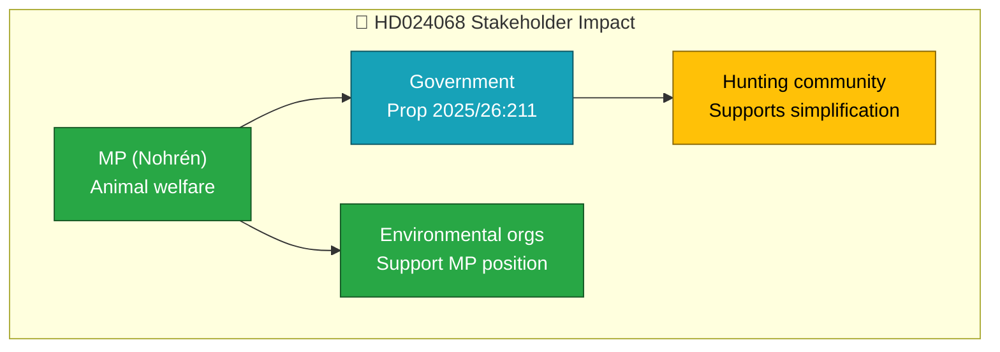

# Document Analysis: Förenklingar i jaktlagstiftningen

| Field | Value |
|-------|-------|
| **dok_id** | HD024068 |
| **Document Type** | Motion |
| **Date** | 2026-04-07 |
| **Author** | Emma Nohrén m.fl. (MP) |
| **Committee** | MJU |
| **Riksmöte** | 2025/26 |
| **Related Proposition** | Prop 2025/26:211 |
| **Significance** | 1/10 — LOW |
| **Confidence** | LOW (metadata-only) |

## Executive Summary

MP motion opposing government's hunting law simplification proposal. MP seeks to reject provisions on public water hunting and seal hunting, and proposes animal welfare safeguards. Reflects green party's environmental/animal welfare policy priorities in opposition to the government's rural/deregulation agenda.

## Policy Domain Classification

| Domain | Confidence |
|--------|:----------:|
| Environmental Policy | HIGH |
| Rural Policy | MEDIUM |

## SWOT Contributions

| Quadrant | Statement | Confidence |
|----------|-----------|:----------:|
| Threat | Environmental policy pushback could create advocacy group pressure | L |

## Stakeholder Impact

## Risk Assessment

| Factor | Score | Rationale |
|--------|:-----:|-----------|
| Coalition risk | 0/5 | Opposition motion |
| Policy change | 1/5 | Government has majority for hunting reform |

## Data Quality Notes

Analysis based on metadata and summary only. Confidence: LOW.
