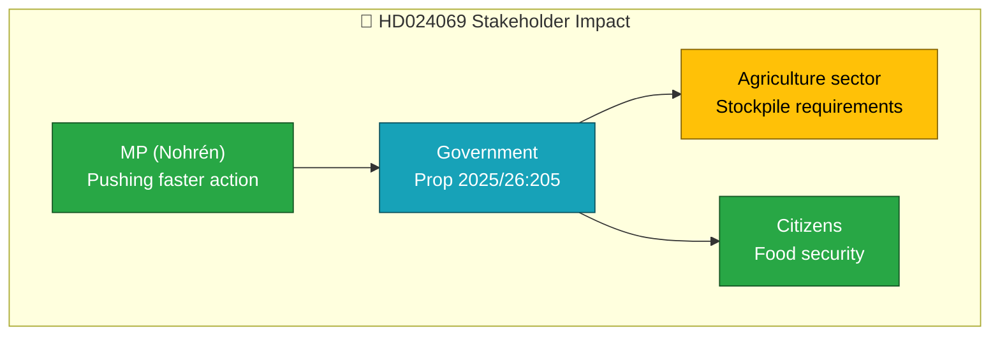

# Document Analysis: Beredskapslager i livsmedelskedjan

| Field | Value |
|-------|-------|
| **dok_id** | HD024069 |
| **Document Type** | Motion |
| **Date** | 2026-04-07 |
| **Author** | Emma Nohrén m.fl. (MP) |
| **Committee** | MJU |
| **Riksmöte** | 2025/26 |
| **Related Proposition** | Prop 2025/26:205 |
| **Significance** | 2/10 — LOW |
| **Confidence** | LOW (metadata-only) |

## Executive Summary

MP motion responding to government proposition 2025/26:205 on food supply emergency stockpiling. MP argues for faster complementation of the government's emergency preparedness planning and the specific food stockpile proposal. This touches on civil defense and total defense preparedness — areas with broad cross-party support but differing views on pace and scope.

## Policy Domain Classification

| Domain | Confidence |
|--------|:----------:|
| Food Security/Preparedness | HIGH |
| Environmental/Climate | MEDIUM |
| Defense/Civil Protection | MEDIUM |

## SWOT Contributions

| Quadrant | Statement | Confidence |
|----------|-----------|:----------:|
| Opportunity | Cross-party consensus on food preparedness strengthens total defense posture | M |
| Weakness | MP critique implies government's pace on preparedness is insufficient | L |

## Stakeholder Impact

## Risk Assessment

| Factor | Score | Rationale |
|--------|:-----:|-----------|
| Coalition risk | 0/5 | Opposition motion — no coalition impact |
| Policy change | 1/5 | Counter-motions to government propositions typically rejected |
| Preparedness gap | 2/5 | Highlights tempo concern but government is already acting |

## Cross-Document References

- Part of MP's 3-motion cluster (HD024067, HD024068, HD024069) — all responding to recent propositions
- Connects to broader preparedness agenda (prop 2025/26:205)

## Data Quality Notes

Analysis based on metadata and summary only. Full-text unavailable. Confidence: LOW.
