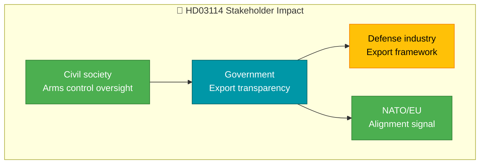

# Document Analysis: Strategisk exportkontroll 2025

| Field | Value |
|-------|-------|
| **dok_id** | HD03114 |
| **Document Type** | Skrivelse (Skr 2025/26:114) |
| **Date** | 2026-04-07 |
| **Author** | Government (Utrikesdepartementet) |
| **Riksmöte** | 2025/26 |
| **Significance** | 2/10 — LOW (already covered by realtime-1026) |
| **Confidence** | LOW (metadata-only) |

## Executive Summary

Annual government report on strategic export control covering military materiel and dual-use products. Signed by PM Svantesson and Minister Dousa (Foreign Affairs). This is a recurring annual report rather than new policy, but its content informs Sweden's NATO alignment and defense industry positioning.

## Policy Domain Classification

| Domain | Confidence |
|--------|:----------:|
| Defense/Security | HIGH |
| Foreign Policy/NATO | HIGH |
| Trade/Export | MEDIUM |

## SWOT Contributions

| Quadrant | Statement | Confidence |
|----------|-----------|:----------:|
| Strength | Demonstrates transparent defense export governance aligned with NATO standards | M |
| Opportunity | Positions Sweden as responsible arms exporter within EU/NATO framework | M |

## Stakeholder Impact

## Risk Assessment

| Factor | Score | Rationale |
|--------|:-----:|-----------|
| Coalition risk | 0/5 | Government report, no opposition challenge |
| Policy change | 1/5 | Annual report, not new legislation |

## Data Quality Notes

Already covered by realtime-1026 run. Analysis based on metadata. Confidence: LOW.
