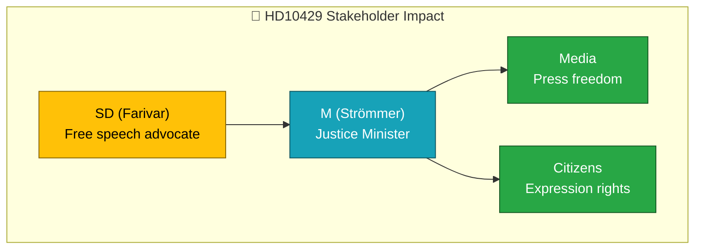

# Document Analysis: Skyddet för yttrandefriheten

| Field | Value |
|-------|-------|
| **dok_id** | HD10429 |
| **Document Type** | Interpellation |
| **Date** | 2026-04-07 |
| **Author** | Rashid Farivar (SD) |
| **Recipient** | Justitieminister Gunnar Strömmer (M) |
| **Riksmöte** | 2025/26 |
| **Significance** | 1/10 — LOW (already covered) |
| **Confidence** | LOW (metadata-only) |

## Executive Summary

SD MP Rashid Farivar questions Justice Minister Gunnar Strömmer (M) about free speech protection in relation to proposition 2025/26:133. References Sweden's 1766 press freedom tradition. This interpellation reflects SD concerns about potential intellectual property legislation impacting free expression.

## Policy Domain Classification

| Domain | Confidence |
|--------|:----------:|
| Constitutional Rights | HIGH |
| Justice/Legal Affairs | MEDIUM |

## SWOT Contributions

| Quadrant | Statement | Confidence |
|----------|-----------|:----------:|
| Strength | Government engages with free speech concerns through ministerial accountability | L |
| Weakness | SD questioning M-held ministry on constitutional rights | L |

## Stakeholder Impact

## Risk Assessment

| Factor | Score | Rationale |
|--------|:-----:|-----------|
| Coalition risk | 1/5 | SD-M friction on constitutional matters, minor |
| Policy change | 1/5 | Interpellation unlikely to change prop 2025/26:133 |

## Data Quality Notes

Already covered by realtime-1026 run. Analysis based on metadata. Confidence: LOW.
