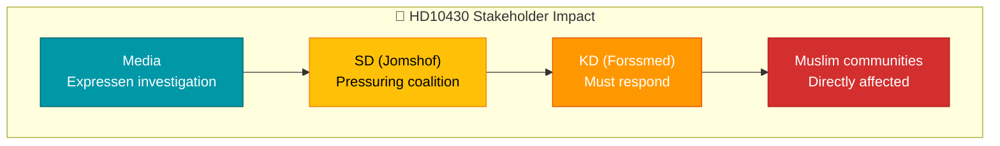

# Document Analysis: Moskéer som sprider hat och hot

| Field | Value |
|-------|-------|
| **dok_id** | HD10430 |
| **Document Type** | Interpellation |
| **Date** | 2026-04-07 |
| **Author** | Richard Jomshof (SD) |
| **Recipient** | Socialminister Jakob Forssmed (KD) |
| **Committee** | SoU |
| **Riksmöte** | 2025/26 |
| **Significance** | 3/10 — LOW |
| **Confidence** | LOW (metadata-only) |

## Executive Summary

SD MP Richard Jomshof files interpellation to Social Minister Jakob Forssmed (KD) regarding mosques in Kristianstad alleged to spread hate speech. References Expressen investigative journalism. This interpellation creates a direct pressure point between SD (support partner) and KD (coalition party) on the sensitive intersection of religious freedom and integration enforcement.

## Policy Domain Classification

| Domain | Confidence |
|--------|:----------:|
| Integration/Migration | HIGH |
| Religious Freedom | HIGH |
| Social Policy | MEDIUM |
| Criminal Justice | LOW |

## SWOT Contributions

| Quadrant | Statement | Confidence |
|----------|-----------|:----------:|
| Weakness | SD publicly pressures coalition partner KD on religious regulation | M |
| Threat | Media-amplified debate could force government stance on mosque oversight | M |
| Opportunity | Government can demonstrate toughness on extremism within religious institutions | L |

## Stakeholder Impact

## Risk Assessment

| Factor | Score | Rationale |
|--------|:-----:|-----------|
| Coalition risk | 2/5 | SD-KD friction on religious policy but within normal parameters |
| Media amplification | 3/5 | Based on Expressen investigation — high media interest potential |
| Policy change likelihood | 1/5 | Interpellations rarely lead directly to legislative change |

## Cross-Document References

- Thematically linked to HD11684 (Syrian returnees) — both reflect SD's integration policy pressure campaign
- Connected to broader SD pattern: 5 of 9 documents today from SD

## Data Quality Notes

Analysis based on metadata and summary only. Full-text unavailable via API. Confidence: LOW.
