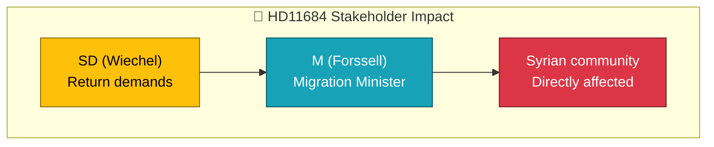

# Document Analysis: Återvändande av syrier

| Field | Value |
|-------|-------|
| **dok_id** | HD11684 |
| **Document Type** | Skriftlig fråga |
| **Date** | 2026-04-07 |
| **Author** | Markus Wiechel (SD) |
| **Recipient** | Migrationsminister Johan Forssell (M) |
| **Riksmöte** | 2025/26 |
| **Significance** | 1/10 — LOW (already covered) |
| **Confidence** | LOW (metadata-only) |

## Executive Summary

SD MP Wiechel questions Migration Minister Forssell (M) about mass return of Syrian citizens following Assad's fall and the new Ahmad al-Sharaa government. References Germany's declared position on Syrian returns. This reflects SD's ongoing pressure on the government to accelerate migration enforcement.

## Policy Domain Classification

| Domain | Confidence |
|--------|:----------:|
| Migration | HIGH |
| Foreign Policy | MEDIUM |

## SWOT Contributions

| Quadrant | Statement | Confidence |
|----------|-----------|:----------:|
| Weakness | SD pressures M-held ministry on migration pace | M |
| Opportunity | Changed Syrian political situation enables policy shift | L |

## Stakeholder Impact

## Risk Assessment

| Factor | Score | Rationale |
|--------|:-----:|-----------|
| Coalition risk | 1/5 | SD-M migration pressure ongoing |
| Policy change | 2/5 | Geopolitical shift may enable policy change |

## Data Quality Notes

Already covered by realtime-1026. Confidence: LOW.
