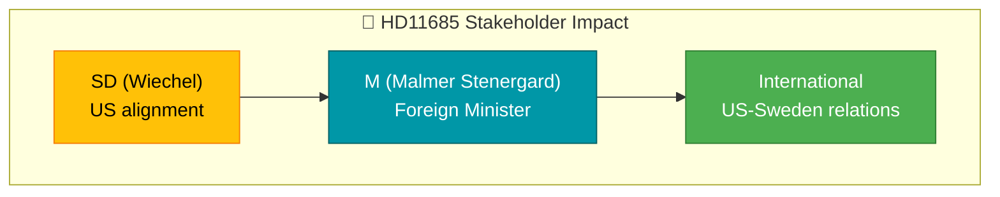

# Document Analysis: Gemensam Kubapolitik med USA

| Field | Value |
|-------|-------|
| **dok_id** | HD11685 |
| **Document Type** | Skriftlig fråga |
| **Date** | 2026-04-07 |
| **Author** | Markus Wiechel (SD) |
| **Recipient** | Utrikesminister Maria Malmer Stenergard (M) |
| **Riksmöte** | 2025/26 |
| **Significance** | 1/10 — LOW (already covered) |
| **Confidence** | LOW (metadata-only) |

## Executive Summary

SD MP Wiechel questions Foreign Minister Malmer Stenergard (M) about aligning Swedish Cuba policy with US approach. Cites Cuba's authoritarian communist regime and human rights restrictions. Routine foreign policy question reflecting SD's pro-US alignment preference.

## Policy Domain Classification

| Domain | Confidence |
|--------|:----------:|
| Foreign Policy | HIGH |
| Human Rights | MEDIUM |

## SWOT Contributions

| Quadrant | Statement | Confidence |
|----------|-----------|:----------:|
| Opportunity | US policy alignment could strengthen transatlantic ties | L |

## Stakeholder Impact

## Risk Assessment

| Factor | Score | Rationale |
|--------|:-----:|-----------|
| Coalition risk | 0/5 | Minor foreign policy question |
| Policy change | 0/5 | Written questions rarely change foreign policy |

## Data Quality Notes

Already covered by realtime-1026. Confidence: LOW.
