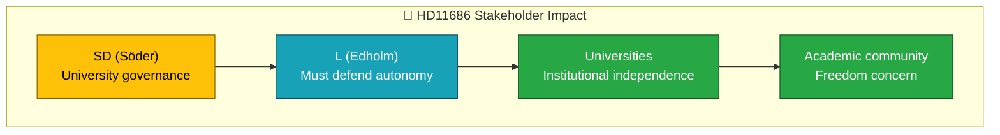

# Document Analysis: Myndighetschefen för Uppsala universitet

| Field | Value |
|-------|-------|
| **dok_id** | HD11686 |
| **Document Type** | Skriftlig fråga |
| **Date** | 2026-04-07 |
| **Author** | Björn Söder (SD) |
| **Recipient** | Gymnasie-, högskole- och forskningsminister Lotta Edholm (L) |
| **Riksmöte** | 2025/26 |
| **Significance** | 1/10 — LOW |
| **Confidence** | LOW (metadata-only) |

## Executive Summary

SD Deputy Speaker Björn Söder questions Education Minister Lotta Edholm (L) about Uppsala University's board making foreign policy statements. This is a follow-up to a previous question (2024/25:1380), indicating persistent SD scrutiny of academic governance and perceived political activism by university leadership.

## Policy Domain Classification

| Domain | Confidence |
|--------|:----------:|
| Education/Academic Freedom | HIGH |
| Constitutional Affairs | MEDIUM |

## SWOT Contributions

| Quadrant | Statement | Confidence |
|----------|-----------|:----------:|
| Weakness | SD targeting L-held ministry creates intra-coalition scrutiny | L |
| Threat | Academic freedom debate could polarize coalition | L |

## Stakeholder Impact

## Risk Assessment

| Factor | Score | Rationale |
|--------|:-----:|-----------|
| Coalition risk | 1/5 | SD questioning L ministry but minor friction |
| Policy change | 0/5 | Written questions rarely lead to policy change |

## Data Quality Notes

Analysis based on metadata and summary only. Confidence: LOW.
