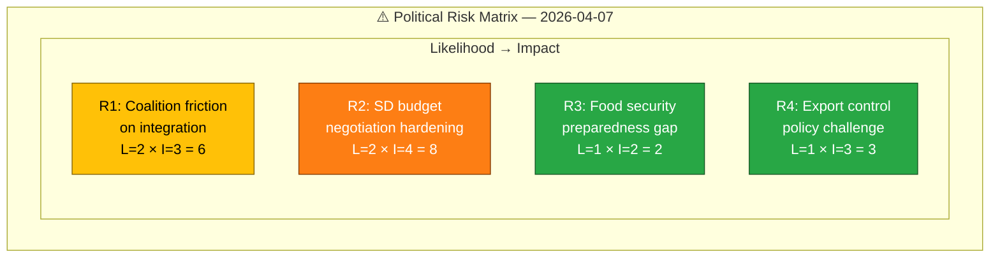

# Political Risk Assessment — 2026-04-07

| Field | Value |
|-------|-------|
| **Risk ID** | `RSK-2026-04-07-1411` |
| **Analysis Date** | 2026-04-07 14:11 UTC |
| **Documents Analyzed** | 9 |
| **Overall Confidence** | LOW |
| **Produced By** | news-realtime-monitor (AI-enriched) |

## Risk Matrix

## Detailed Risk Assessment

| # | Risk | Likelihood (1-5) | Impact (1-5) | Score | Level | Evidence (dok_id) |
|---|------|:-----------------:|:------------:|:-----:|:-----:|-------------------|
| R1 | Coalition friction on integration/religious institutions policy | 2 | 3 | 6 | MEDIUM | HD10430, HD11684 |
| R2 | SD hardening demands ahead of autumn budget negotiations | 2 | 4 | 8 | MEDIUM | HD11684, HD11685, HD10430 |
| R3 | Food security preparedness gap highlighted by MP motion | 1 | 2 | 2 | LOW | HD024069 |
| R4 | Export control policy challenged in committee | 1 | 3 | 3 | LOW | HD03114 |

## Coalition Risk Score

**Coalition Risk Score**: 4/100 (LOW)

No documents indicate imminent coalition instability. SD parliamentary questions follow standard oversight patterns. The coalition's working majority is not under threat.

## Key Findings

1. Highest individual risk: SD budget negotiation hardening (score 8/25) — still within manageable range
2. Integration policy creates the most visible coalition tension point (HD10430)
3. No votes in parliament today — latest vote March 4, 2026 (AU10)
4. No committee reports or propositions published today beyond the already-covered HD03114

## Forward Risk Indicators

| Indicator | Trigger | Risk Escalation | Timeline |
|-----------|---------|-----------------|----------|
| Mosque interpellation debate | Media coverage of debate | R1 escalates to MEDIUM-HIGH | 2-4 weeks |
| Autumn budget talks | SD signals policy demands | R2 escalates to HIGH | Q3 2026 |

## Data Quality Notes

Risk assessment confidence: **LOW**. Based on metadata-only documents. Coalition risk metrics sourced from CIA data (score 4/100).