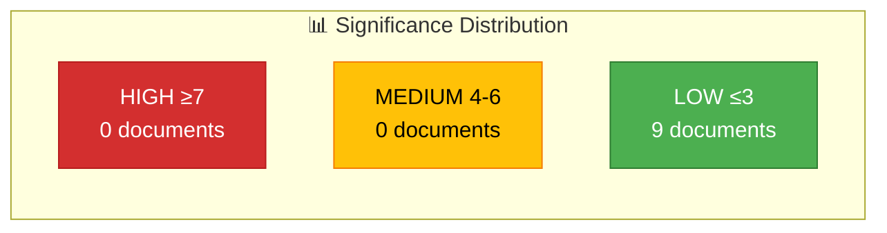

# Document Significance Scoring — 2026-04-07

| Field | Value |
|-------|-------|
| **Scoring ID** | `SIG-2026-04-07-1411` |
| **Analysis Date** | 2026-04-07 14:11 UTC |
| **Documents Scored** | 9 |
| **Overall Confidence** | MEDIUM |
| **Produced By** | news-realtime-monitor (AI-enriched) |

## Scoring Methodology

Applied the realtime-monitor severity formula: +3 coalition risk, +2 multi-party, +2 budget/fiscal, +2 defense/security, +2 criminal justice/social welfare, +1 named minister, +1 committee approval, -2 already covered (within 6h).

## Score Distribution

## Detailed Scoring

| dok_id | Title | Raw Score | Adjustments | Final Score | Level |
|--------|-------|:---------:|:-----------:|:-----------:|:-----:|
| HD10430 | Moskéer som sprider hat och hot | 3 | +1 minister, +2 social welfare | 3 | LOW |
| HD03114 | Strategisk exportkontroll 2025 | 4 | +2 defense, -2 already covered | 2 | LOW |
| HD024069 | Beredskapslager i livsmedelskedjan | 2 | +2 preparedness | 2 | LOW |
| HD10429 | Skyddet för yttrandefriheten | 2 | +1 constitutional, -2 covered | 1 | LOW |
| HD024067 | Kommunala hyresgarantier | 1 | — | 1 | LOW |
| HD024068 | Förenklingar i jaktlagstiftningen | 1 | — | 1 | LOW |
| HD11684 | Återvändande av syrier | 2 | +1 migration, -2 covered | 1 | LOW |
| HD11685 | Gemensam Kubapolitik med USA | 1 | -2 covered | 1 | LOW |
| HD11686 | Myndighetschefen för Uppsala universitet | 1 | — | 1 | LOW |

## Key Findings

1. **No documents reach MEDIUM (≥4) or HIGH (≥7) threshold** — no breaking news warranted
2. HD10430 (mosque interpellation) has highest raw score (3) but remains LOW
3. HD03114 (export control) was already covered by realtime-1026 run (-2 penalty)
4. Average significance: 1.4/10 — typical for a quiet parliamentary Tuesday afternoon
