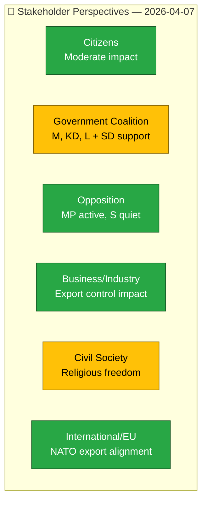

# Stakeholder Perspective Analysis — 2026-04-07

| Field | Value |
|-------|-------|
| **Stakeholder ID** | `STK-2026-04-07-1411` |
| **Analysis Date** | 2026-04-07 14:11 UTC |
| **Documents Analyzed** | 9 |
| **Overall Confidence** | MEDIUM |
| **Produced By** | news-realtime-monitor (AI-enriched) |

## Stakeholder Impact Map

## Perspective Analysis

| Stakeholder Group | Primary Impact | Key Documents | Assessment |
|-------------------|---------------|---------------|:----------:|
| Citizens | Housing guarantees, food security preparedness | HD024067, HD024069 | LOW |
| Government Coalition | Defending agenda against SD pressure | HD10430, HD11684 | MEDIUM |
| Opposition Bloc | MP filing counter-motions; S, V, C, L quiet today | HD024067-69 | LOW |
| Business/Industry | Strategic export control affects defense exporters | HD03114 | LOW |
| Civil Society | Religious freedom vs. integration enforcement debate | HD10430 | MEDIUM |
| International/EU | Export control alignment with EU/NATO standards | HD03114 | LOW |
| Judiciary/Constitutional | Free speech interpellation (HD10429) | HD10429 | LOW |
| Media/Public Opinion | Mosque debate may generate media coverage | HD10430 | MEDIUM |

## Key Findings

1. Government coalition faces moderate stakeholder pressure from SD on integration (HD10430)
2. Civil society stakeholders most affected by mosque regulation debate
3. Business impact limited to defense export sector (HD03114)
4. International stakeholders see routine alignment activity
