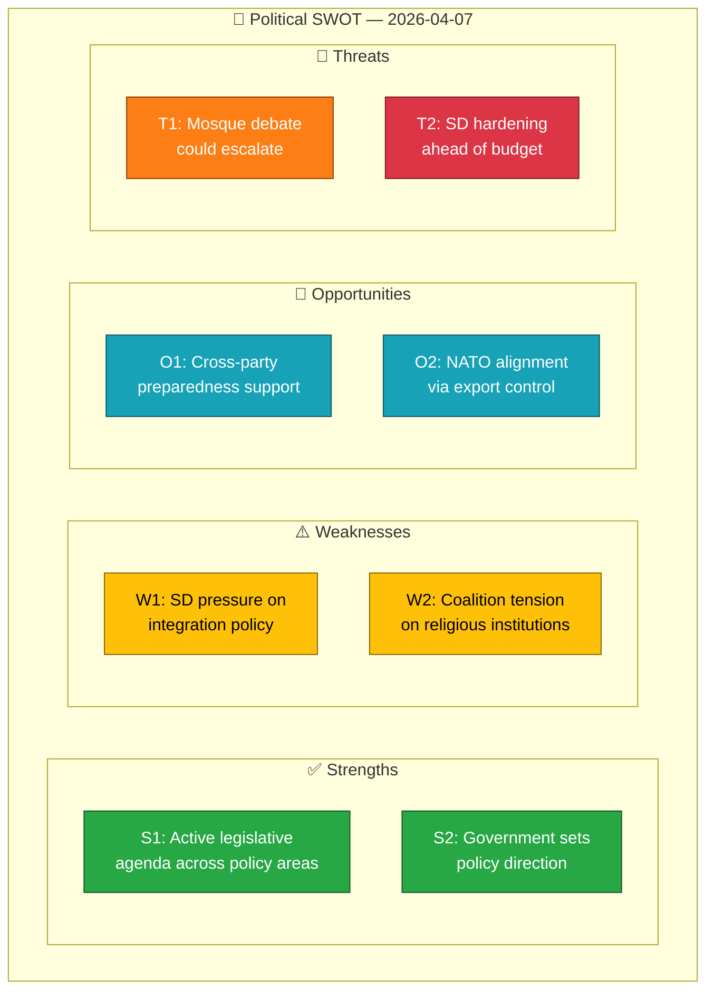

# Political SWOT Analysis — 2026-04-07

| Field | Value |
|-------|-------|
| **SWOT ID** | `SWT-2026-04-07-1411` |
| **Analysis Date** | 2026-04-07 14:11 UTC |
| **Analysis Scope** | Government coalition vs. opposition activity |
| **Reference Period** | 2026-04-07 |
| **Produced By** | news-realtime-monitor (AI-enriched) |
| **Primary MCP Sources** | search_dokument, get_propositioner, get_interpellationer, get_fragor |
| **Temporal Window** | 2026-04-07 00:00–14:11 UTC |

## 🏛️ Government Coalition SWOT

### ✅ Strengths

| # | Strength Statement | Evidence (dok_id) | Confidence | Impact | Entry Date |
|---|-------------------|-------------------|:----------:|:------:|:----------:|
| S1 | Government maintains legislative initiative with strategic export control report (Skr 2025/26:114) demonstrating active defense/security agenda | HD03114 | M | M | 2026-04-07 |
| S2 | Opposition motions respond to government propositions (housing, hunting, food security) — government sets policy agenda | HD024067, HD024068, HD024069 | H | L | 2026-04-07 |

**Coalition Strength Summary:** The government continues to drive the legislative agenda across defense, housing, hunting, and food security domains, with opposition parties reacting to government proposals rather than setting their own agenda.

### ⚠️ Weaknesses

| # | Weakness Statement | Evidence (dok_id) | Confidence | Impact | Entry Date |
|---|-------------------|-------------------|:----------:|:------:|:----------:|
| W1 | SD support partner publicly pressures government on integration, religious institutions, and academic governance through multiple parliamentary questions | HD10430, HD11684, HD11686 | H | M | 2026-04-07 |
| W2 | Interpellation on mosque hate speech (HD10430) directed to Social Minister Forssmed (KD) exposes coalition tensions on religion/integration approach | HD10430 | M | M | 2026-04-07 |

**Coalition Weakness Summary:** SD's parliamentary questions on sensitive integration topics create visible pressure on government ministers, potentially exposing disagreements within the coalition on religious freedom vs. integration enforcement.

### 🌟 Opportunities

| # | Opportunity Statement | Evidence (dok_id) | Confidence | Impact | Entry Date |
|---|----------------------|-------------------|:----------:|:------:|:----------:|
| O1 | Food security preparedness (prop 2025/26:205) aligns with broad cross-party support for civil defense strengthening | HD024069 | M | M | 2026-04-07 |
| O2 | Strategic export control report positions Sweden as responsible NATO partner | HD03114 | M | L | 2026-04-07 |

### 🚨 Threats

| # | Threat Statement | Evidence (dok_id) | Confidence | Impact | Entry Date |
|---|-----------------|-------------------|:----------:|:------:|:----------:|
| T1 | SD interpellation on mosque hate speech could escalate into broader religious freedom debate, creating coalition friction | HD10430 | M | M | 2026-04-07 |
| T2 | Multiple SD questions on migration/foreign policy signal potential hardening of SD demands ahead of 2026 budget negotiations | HD11684, HD11685 | L | M | 2026-04-07 |

## 📊 SWOT Quadrant Mapping

## TOWS Strategic Options

| Option | SWOT Combination | Description |
|--------|-----------------|-------------|
| SO-1 | S1 + O2 | Leverage export control report to reinforce NATO commitment narrative |
| WT-1 | W1 + T1 | Proactively address SD integration concerns before mosque debate escalates |

## Cross-SWOT Interference

SD's parliamentary questions (W1) amplify threat T1 — if mosque interpellation debate generates media attention, it could force the government to take a public stance that either satisfies SD or alienates moderate coalition partners (L, KD).

## Data Quality Notes

SWOT confidence: LOW. Analysis based on metadata-only documents. Full-text analysis would enable higher-confidence assessments.