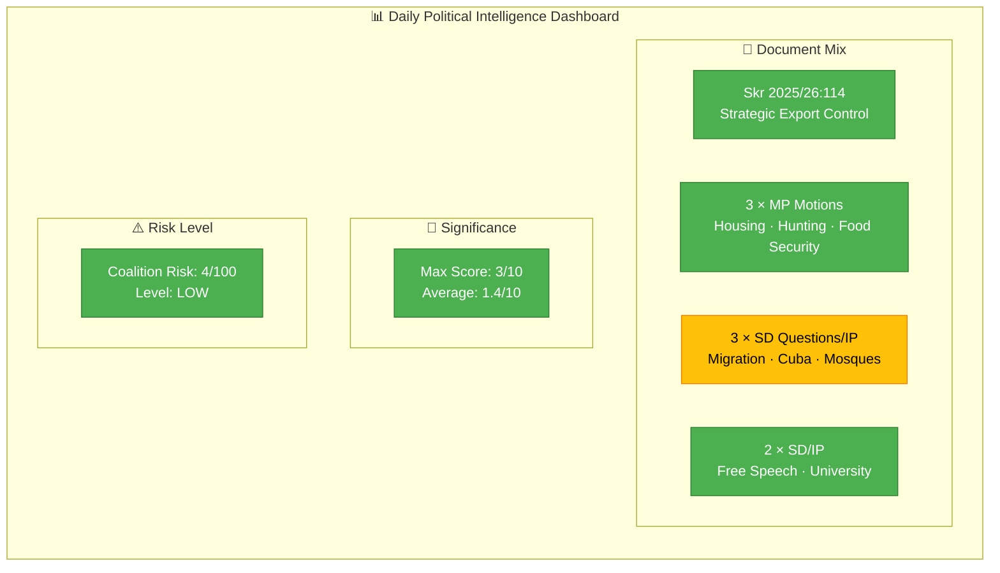
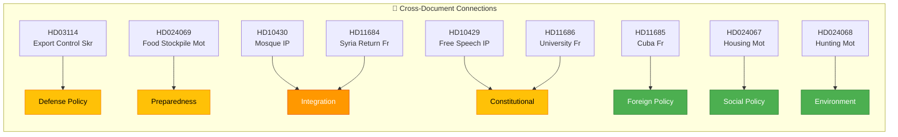

# Analysis Synthesis Summary — 2026-04-07

| Field | Value |
|-------|-------|
| **Synthesis ID** | `SYN-2026-04-07-1411` |
| **Analysis Date** | `2026-04-07 14:11 UTC` |
| **Documents Analyzed** | 9 |
| **Analysis Period** | 2026-04-07 00:00–14:11 UTC |
| **Produced By** | news-realtime-monitor (AI-enriched) |
| **Overall Confidence** | LOW |
| **Data Freshness** | Documents sourced from **2026-04-07** |

## 📊 Intelligence Dashboard

## Cross-Document Pattern Analysis

Three thematic clusters emerge from today's 9 documents:

**Cluster 1 — Defense & Export Control** (HD03114): The government's annual strategic export control report covers military materiel and dual-use products. This connects to the broader defense procurement and NATO alignment agenda. Already covered by the morning realtime-1026 run.

**Cluster 2 — Opposition Motions on Government Proposals** (HD024067, HD024068, HD024069): MP filed three motions responding to recent government propositions on housing guarantees (prop 2025/26:212), hunting law simplification (prop 2025/26:211), and food supply emergency stockpiling (prop 2025/26:205). These represent green party pushback on rural/environmental policy and food security preparedness.

**Cluster 3 — SD Questions on Migration, Religion & Academic Freedom** (HD11684, HD11685, HD11686, HD10430, HD10429): SD members filed questions on Syrian returnees, Cuba policy, mosque hate speech, Uppsala university governance, and free speech protection. This reflects SD's ongoing pressure on the government's integration, foreign policy, and academic governance positions.

## Top Documents by Significance

| Score | Type | dok_id | Title | Policy Domain |
|-------|------|--------|-------|--------------|
| 3/10 | ip | HD10430 | Moskéer som sprider hat och hot | Integration/Religious freedom |
| 2/10 | skr | HD03114 | Strategisk exportkontroll 2025 | Defense/Security |
| 2/10 | mot | HD024069 | Beredskapslager i livsmedelskedjan | Food security/Preparedness |
| 1/10 | mot | HD024067 | Kommunala hyresgarantier | Housing policy |
| 1/10 | mot | HD024068 | Förenklingar i jaktlagstiftningen | Environmental policy |
| 1/10 | fr | HD11684 | Återvändande av syrier | Migration |
| 1/10 | fr | HD11685 | Gemensam Kubapolitik med USA | Foreign policy |
| 1/10 | fr | HD11686 | Myndighetschefen för Uppsala universitet | Education/Academic freedom |
| 1/10 | ip | HD10429 | Skyddet för yttrandefriheten | Constitutional rights |

## Aggregate Risk Assessment

Coalition risk score: **4/100** (LOW). No documents indicate coalition instability. SD continues to operate within the support agreement framework, directing parliamentary questions at ministers rather than challenging the coalition itself. MP opposition motions follow standard procedure (responding to government propositions) and do not signal unexpected cross-party alignment.

## Forward Intelligence — What to Watch

| Indicator | Trigger | Timeline | Confidence |
|-----------|---------|----------|:----------:|
| HD10430 debate scheduling | Interpellation on mosque hate speech may generate media attention when debated | 2-4 weeks | M |
| HD024069 committee vote | MJU committee decision on food stockpile motion | 4-8 weeks | L |
| HD03114 committee referral | UU committee processing of export control report | 4-8 weeks | L |

## Data Quality Notes

Overall confidence: **LOW**. Most documents are metadata-only (no full-text available via API). 4 of 9 documents (HD03114, HD10429, HD11684, HD11685) were already covered by the realtime-1026 run earlier today. New documents are routine motions and parliamentary questions with low significance.