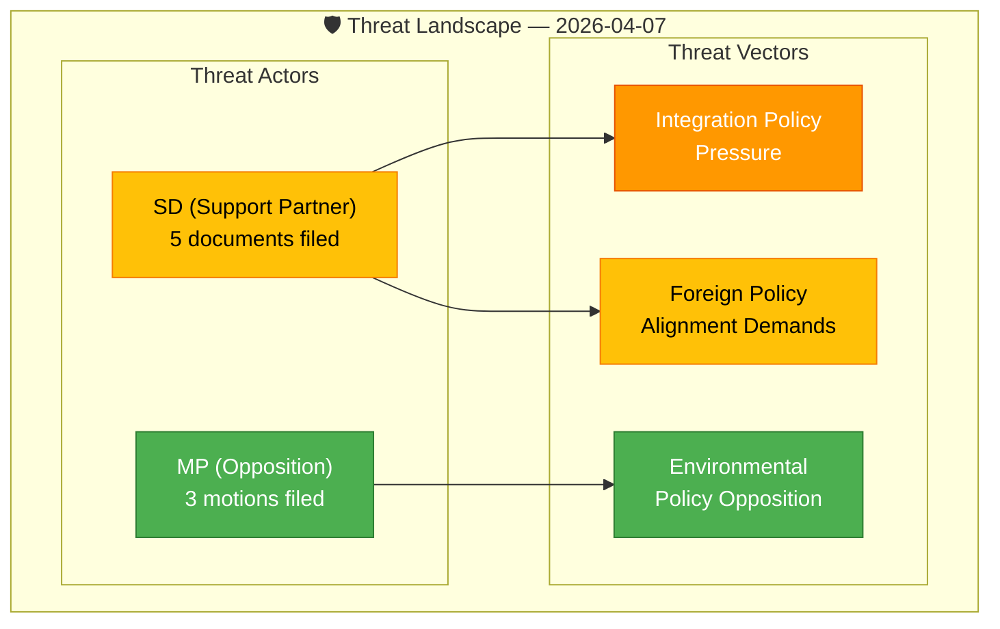

# Political Threat Analysis — 2026-04-07

| Field | Value |
|-------|-------|
| **Threat ID** | `THR-2026-04-07-1411` |
| **Analysis Date** | 2026-04-07 14:11 UTC |
| **Documents Analyzed** | 9 |
| **Overall Confidence** | LOW |
| **Produced By** | news-realtime-monitor (AI-enriched) |

## Threat Landscape Summary

Today's parliamentary documents reveal no acute threats to governance stability. SD's multipronged questioning strategy (migration, foreign policy, religious institutions, academic governance) represents a sustained pressure campaign rather than an immediate crisis vector.

## Threat Classification

| # | Threat | Actor | Vector | Severity | Likelihood | Evidence (dok_id) |
|---|--------|-------|--------|:--------:|:----------:|-------------------|
| T1 | SD pressures government on mosque regulation | SD (Jomshof) | Interpellation to Social Minister | MEDIUM | LOW | HD10430 |
| T2 | SD demands US-aligned Cuba policy shift | SD (Wiechel) | Written question to Foreign Minister | LOW | LOW | HD11685 |
| T3 | SD challenges university governance independence | SD (Söder) | Written question to Education Minister | LOW | LOW | HD11686 |
| T4 | MP challenges government on food preparedness | MP (Nohrén) | Counter-motion to prop 2025/26:205 | LOW | LOW | HD024069 |

## Kill Chain Analysis — SD Integration Pressure

1. **Reconnaissance**: Media reports on mosque activities (Expressen investigation cited in HD10430)
2. **Weaponization**: Interpellation filed to Social Minister Forssmed (KD)
3. **Delivery**: Scheduled Riksdag debate (pending)
4. **Exploitation**: Potential media amplification forces government response
5. **Current stage**: Delivery (awaiting debate scheduling)

## Key Findings

1. SD filed 5 of 9 documents today — concentrated opposition pressure from support partner
2. No threat reaches HIGH severity — all within normal parliamentary discourse
3. Richard Jomshof's mosque interpellation is the highest-profile threat vector (HD10430)
4. MP's 3 motions represent standard green party opposition — no cross-party coordination observed

## Data Quality Notes

Analysis confidence: **LOW**. Based on metadata-only documents. Full-text analysis of interpellation HD10430 would enable more precise threat assessment.