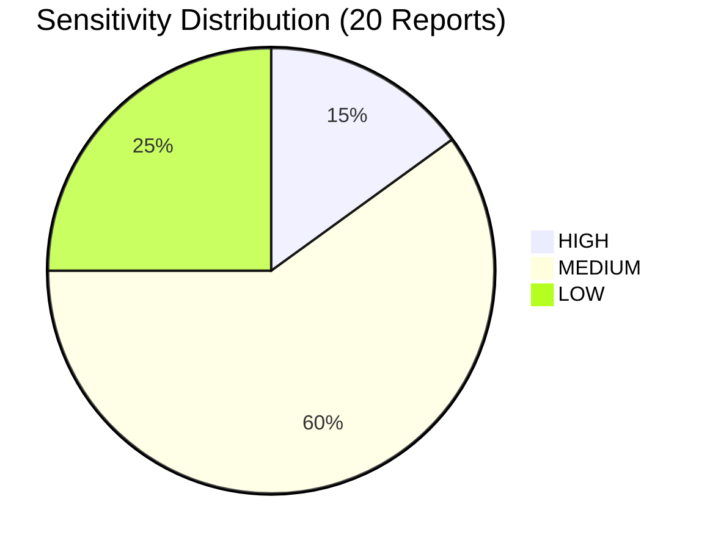
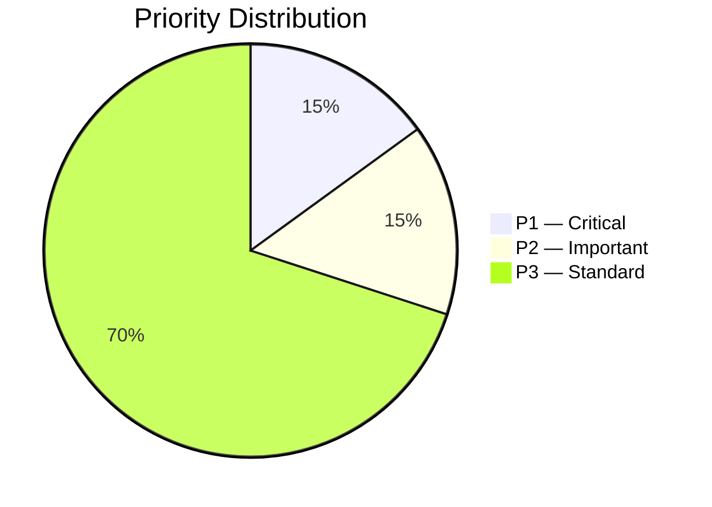
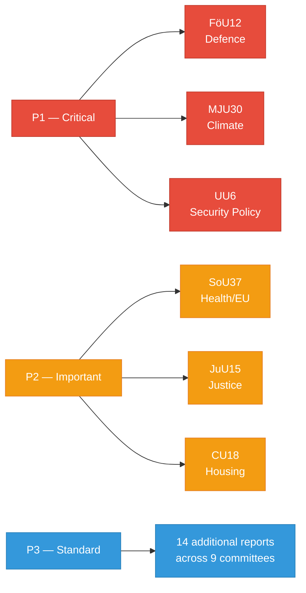

# Document Classification — 2026-04-08

| **Key** | **Value** |
|---------|-----------|
| **ID** | CLS-2026-04-08-CR01 |
| **Generated** | 2026-04-08 04:32 UTC |
| **Data Sources** | get_betankanden (20 reports) |
| **Documents Analyzed** | 20 |
| **Riksmöte** | 2025/26 |
| **Overall Confidence** | HIGH |
| **Produced By** | AI-enhanced analysis (news-journalist agent) |

## Summary

Classified 20 committee reports by policy domain, sensitivity level, and urgency. Reports span 12 committees and 8 policy domains. Defence and climate-related reports carry highest sensitivity.

## Classification Table

| dok_id | Committee | Policy Domain | Sensitivity | Urgency | Priority |
|--------|-----------|--------------|-------------|---------|----------|
| HD01FöU12 | FöU | Defence & Security | HIGH | HIGH | P1 |
| HD01MJU30 | MJU | Climate & Environment | HIGH | HIGH | P1 |
| HD01UU6 | UU | Foreign & Security Policy | HIGH | MEDIUM | P1 |
| HD01SoU37 | SoU | Health/EU Governance | MEDIUM | MEDIUM | P2 |
| HD01JuU15 | JuU | Justice & Corrections | MEDIUM | MEDIUM | P2 |
| HD01CU18 | CU | Housing Policy | MEDIUM | HIGH | P2 |
| HD01KU38 | KU | Parliamentary Governance | MEDIUM | LOW | P3 |
| HD01KU31 | KU | Cultural/Language Rights | MEDIUM | MEDIUM | P3 |
| HD01SoU16 | SoU | Healthcare | MEDIUM | MEDIUM | P3 |
| HD01SoU17 | SoU | Healthcare | MEDIUM | MEDIUM | P3 |
| HD01SoU19 | SoU | Social Services | MEDIUM | MEDIUM | P3 |
| HD01AU11 | AU | Equality | LOW | LOW | P3 |
| HD01AU12 | AU | Work Environment | LOW | LOW | P3 |
| HD01FöU11 | FöU | Maritime Emergency Response | MEDIUM | LOW | P3 |
| HD01JuU16 | JuU | Police Matters | MEDIUM | MEDIUM | P3 |
| HD01SfU18 | SfU | Social Insurance | LOW | LOW | P3 |
| HD01MJU18 | MJU | EU Trade/Agriculture | MEDIUM | MEDIUM | P3 |
| HD01CU17 | CU | Consumer Rights | LOW | LOW | P3 |
| HD01NU17 | NU | Energy Markets | MEDIUM | MEDIUM | P3 |
| HD01KrU10 | KrU | Cultural Policy/EU | LOW | LOW | P3 |

## Classification Distribution

## Data Quality Notes

Classification confidence: **HIGH** for domain assignment (committee-based), **MEDIUM** for sensitivity assessment. [HIGH] confidence in committee mapping verified against Riksdag committee codes. Cross-referenced against 12 active committees in riksmöte 2025/26.
