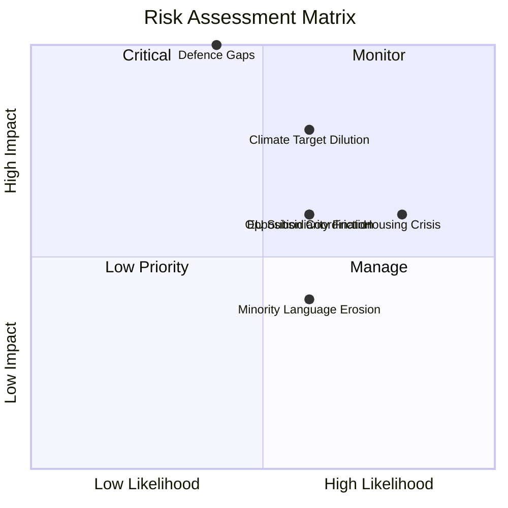

# Political Risk Assessment — 2026-04-08

| **Key** | **Value** |
|---------|-----------|
| **ID** | RISK-2026-04-08-CR01 |
| **Generated** | 2026-04-08 04:32 UTC |
| **Data Sources** | get_betankanden (20 reports), CIA coalition metrics |
| **Documents Analyzed** | 20 |
| **Riksmöte** | 2025/26 |
| **Overall Confidence** | MEDIUM |
| **Coalition Risk Score** | 18/100 |
| **Risk Level** | MODERATE |
| **Produced By** | AI-enhanced analysis (news-journalist agent) |

## Summary

Coalition demonstrates moderate risk across 20 committee reports. Defence and climate policy areas show highest political tension. The systematic rejection of 346+ opposition motions across CU18, CU17, and NU17 indicates strong coalition discipline but creates political risk from opposition narrative consolidation.

## Risk Matrix

| # | Risk Description | Likelihood (1-5) | Impact (1-5) | L×I Score | Level | Evidence |
|---|-----------------|-------------------|--------------|-----------|-------|----------|
| 1 | Climate target dilution weakens Sweden's international credibility and EU standing | 3 | 4 | 12 | HIGH | MJU30 adapts national targets to EU framework |
| 2 | Housing affordability crisis deepens after CU18 rejects 131 reform motions | 4 | 3 | 12 | HIGH | CU18 — government cites "ongoing work" |
| 3 | Defence preparedness gaps during FöU12 civilian protection implementation | 2 | 5 | 10 | HIGH | FöU12 — new framework requires resources |
| 4 | EU institutional friction from SoU37 subsidiarity challenge on health directive | 3 | 3 | 9 | MODERATE | SoU37 — motiverat yttrande to EU institutions |
| 5 | Opposition coordination strengthens on housing, climate, children's welfare platform | 3 | 3 | 9 | MODERATE | CU18, MJU30, SoU19 — S,V,MP,C motion patterns |
| 6 | Minority language erosion continues despite KU31 NAO critique | 3 | 2 | 6 | MODERATE | KU31 — state efforts "not sufficient" per Riksrevisionen |

## Anomaly Flags

1. **Unusually high motion rejection rate**: CU18 (131), CU17 (83), NU17 (132), SoU19 (115) — total 461 motions rejected across 4 reports [MEDIUM confidence]
2. **SoU37 subsidiarity challenge**: Parliament sending motiverat yttrande to EU is relatively rare — signals strong stance on national health sovereignty [HIGH confidence]

## Forward Risk Indicators

1. **MJU30 Opposition Reservations**: Watch for reservation count and party signatories — high reservation count signals potential coalition stress on climate [HIGH]
2. **Spring Budget Implications**: FöU12 and UU6 defence commitments will need funding — watch appropriations committee (FiU) follow-up [MEDIUM]
3. **EU Commission Response to SoU37**: Response expected May-June 2026 — may trigger diplomatic engagement [MEDIUM]

## Data Quality Notes

Risk assessment derived from 20 committee report summaries and CIA coalition metrics. Vote record data pending (pre-chamber debate stage for most reports). Coalition risk score of 18/100 reflects moderate concern primarily from climate and housing policy areas.
