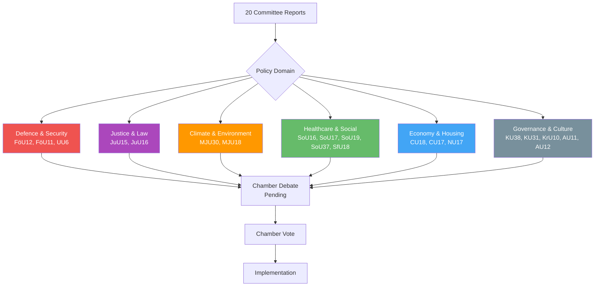

# Political SWOT Analysis — 2026-04-08

| **Key** | **Value** |
|---------|-----------|
| **ID** | SWOT-2026-04-08-CR01 |
| **Generated** | 2026-04-08 04:32 UTC |
| **Data Sources** | get_betankanden (20 reports) |
| **Documents Analyzed** | 20 |
| **Riksmöte** | 2025/26 |
| **Overall Confidence** | MEDIUM |
| **Produced By** | AI-enhanced analysis (news-journalist agent) |

## Stakeholder SWOT Analysis

### 1. Citizens

| # | Type | Statement | Evidence (dok_id) | Confidence | Impact |
|---|------|-----------|-------------------|------------|--------|
| 1 | Strength | Stronger civilian protection framework during heightened preparedness | FöU12 | HIGH | HIGH |
| 2 | Weakness | 131 housing motions rejected — no new affordability measures | CU18 | HIGH | HIGH |
| 3 | Opportunity | Healthcare reorganization could improve access if implemented well | SoU16 | MEDIUM | MEDIUM |
| 4 | Threat | Climate target weakening may harm long-term environmental quality | MJU30 | MEDIUM | HIGH |

### 2. Government Coalition (M, KD, L + SD support)

| # | Type | Statement | Evidence (dok_id) | Confidence | Impact |
|---|------|-----------|-------------------|------------|--------|
| 1 | Strength | Successfully advancing defence and security agenda post-NATO | FöU12, UU6 | HIGH | HIGH |
| 2 | Strength | Criminal justice agenda progressing through JuU committee | JuU15, JuU16 | HIGH | MEDIUM |
| 3 | Weakness | Mass rejection of opposition motions (CU18: 131, CU17: 83, NU17: 132) signals legislative inflexibility | CU18, CU17, NU17 | HIGH | MEDIUM |
| 4 | Opportunity | EU climate target alignment (MJU30) provides cover for domestic policy adjustments | MJU30 | MEDIUM | HIGH |
| 5 | Threat | SoU37 subsidiarity challenge may strain EU relations | SoU37 | MEDIUM | MEDIUM |

### 3. Opposition Bloc (S, V, MP, C)

| # | Type | Statement | Evidence (dok_id) | Confidence | Impact |
|---|------|-----------|-------------------|------------|--------|
| 1 | Strength | High volume of policy proposals (346+ motions across CU18, CU17, NU17) demonstrates agenda-setting | CU18, CU17, NU17 | HIGH | MEDIUM |
| 2 | Weakness | Systematic rejection of motions — low legislative impact | CU18, CU17, SoU19 | HIGH | HIGH |
| 3 | Opportunity | Housing crisis (CU18) and climate targets (MJU30) offer strong campaign narratives | CU18, MJU30 | MEDIUM | HIGH |
| 4 | Threat | Government framing of motion rejections as "ongoing work" neutralizes opposition criticism | CU18, CU17, NU17 | MEDIUM | MEDIUM |

### 4. Business/Industry

| # | Type | Statement | Evidence (dok_id) | Confidence | Impact |
|---|------|-----------|-------------------|------------|--------|
| 1 | Strength | Electricity market policy continuity (NU17 rejects change motions) provides stability | NU17 | MEDIUM | HIGH |
| 2 | Weakness | UTP directive implementation (MJU18) may increase compliance burden on food supply chain | MJU18 | MEDIUM | MEDIUM |
| 3 | Opportunity | Defence sector growth from FöU12 civilian protection investments | FöU12 | MEDIUM | HIGH |
| 4 | Threat | Climate target uncertainty (MJU30) creates investment planning challenges | MJU30 | MEDIUM | MEDIUM |

### 5. Civil Society

| # | Type | Statement | Evidence (dok_id) | Confidence | Impact |
|---|------|-----------|-------------------|------------|--------|
| 1 | Strength | Minority language protection elevated by NAO audit (KU31) | KU31 | HIGH | MEDIUM |
| 2 | Weakness | 115 motions on children in social services rejected (SoU19) | SoU19 | HIGH | HIGH |
| 3 | Opportunity | Parliamentary process reform (KU38) could improve citizen engagement | KU38 | LOW | MEDIUM |
| 4 | Threat | Gender equality and anti-discrimination measures face legislative gridlock (AU11) | AU11 | MEDIUM | MEDIUM |

### 6. International/EU

| # | Type | Statement | Evidence (dok_id) | Confidence | Impact |
|---|------|-----------|-------------------|------------|--------|
| 1 | Strength | Sweden asserting subsidiarity on EU health directives (SoU37 motiverat yttrande) | SoU37 | HIGH | MEDIUM |
| 2 | Weakness | Climate target adaptation (MJU30) may signal weakened ambition to EU partners | MJU30 | MEDIUM | HIGH |
| 3 | Opportunity | EU Cultural Compass (KrU10) enables cultural exchange and digitization partnerships | KrU10 | MEDIUM | LOW |
| 4 | Threat | NATO integration pressure requires faster defence reform implementation | FöU12, UU6 | MEDIUM | HIGH |

### 7. Judiciary/Constitutional

| # | Type | Statement | Evidence (dok_id) | Confidence | Impact |
|---|------|-----------|-------------------|------------|--------|
| 1 | Strength | Correctional system review (JuU15) addresses systemic capacity issues | JuU15 | MEDIUM | MEDIUM |
| 2 | Weakness | Police matters (JuU16) motion rejections may delay operational reforms | JuU16 | MEDIUM | MEDIUM |
| 3 | Opportunity | Parliamentary process reform (KU38) could strengthen constitutional oversight | KU38 | LOW | MEDIUM |
| 4 | Threat | Defence preparedness legislation (FöU12) may test civil liberties boundaries | FöU12 | LOW | HIGH |

### 8. Media/Public Opinion

| # | Type | Statement | Evidence (dok_id) | Confidence | Impact |
|---|------|-----------|-------------------|------------|--------|
| 1 | Strength | High-profile reports (FöU12, MJU30, UU6) generate strong public interest | FöU12, MJU30, UU6 | HIGH | MEDIUM |
| 2 | Weakness | Mass motion rejections risk "rubber stamp" narrative for Parliament | CU18, CU17, NU17, SoU19 | MEDIUM | MEDIUM |
| 3 | Opportunity | Climate target debate (MJU30) likely to drive significant media coverage and public discourse | MJU30 | HIGH | HIGH |
| 4 | Threat | Information fatigue from 20+ simultaneous committee reports reduces public engagement | All reports | MEDIUM | LOW |

## Committee Report Legislative Flow

## Data Quality Notes

SWOT confidence: **MEDIUM**. Analysis based on committee report summaries and metadata. Vote records not yet available for most reports (pre-chamber debate stage). Evidence density is strong for structural claims but limited for party positioning on specific votes.
