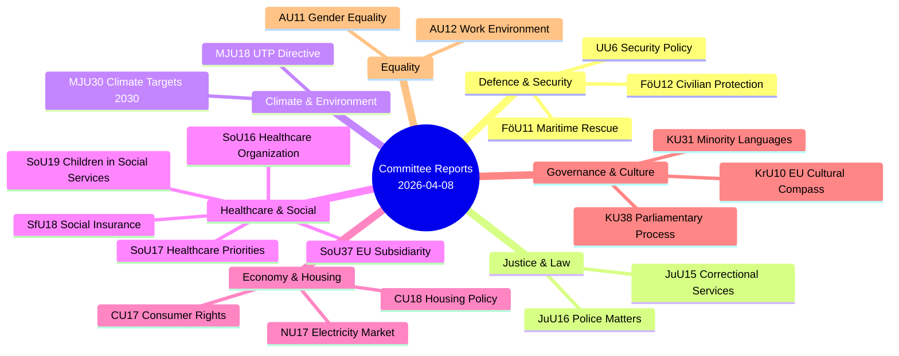

# Analysis Synthesis Summary — 2026-04-08

| **Key** | **Value** |
|---------|-----------|
| **ID** | SYN-2026-04-08-CR01 |
| **Generated** | 2026-04-08 04:32 UTC |
| **Data Sources** | get_betankanden, search_voteringar |
| **Documents Analyzed** | 20 |
| **Riksmöte** | 2025/26 |
| **Overall Confidence** | MEDIUM |
| **Risk Level** | MODERATE |
| **Produced By** | AI-enhanced analysis (news-journalist agent) |

## Summary

Analysis of 20 committee reports (betänkanden) from the Swedish Riksdag covering March 26 – April 2, 2026. Reports span 12 parliamentary committees addressing defence preparedness, criminal justice, climate targets, security policy, healthcare, housing, consumer rights, equality, social insurance, electricity markets, EU subsidiarity, and cultural policy. The Defence Committee (FöU) and Environment Committee (MJU) reports carry highest political significance due to civilian protection and climate target policy changes.

## Key Findings

1. **Defence & Security Surge** [HIGH]: FöU12 strengthens civilian protection during heightened preparedness, UU6 addresses security policy — reflecting Sweden's post-NATO accession defence posture realignment
2. **Climate Target Recalibration** [HIGH]: MJU30 adapts Sweden's 2030 climate targets to EU frameworks — signals potential weakening of national ambitions
3. **Criminal Justice Consolidation** [MEDIUM]: JuU15 (correctional services) and JuU16 (police matters) represent continued law-and-order emphasis from coalition
4. **Healthcare Governance** [MEDIUM]: SoU16 (healthcare organization), SoU17 (healthcare priorities), SoU37 (EU subsidiarity on GMO/organ directive) show active health policy front
5. **EU Sovereignty Assertion** [HIGH]: SoU37 subsidiarity challenge and KrU10 cultural compass response demonstrate Parliament's stance on EU competence boundaries
6. **Housing & Consumer Stasis** [LOW]: CU18 (131 motions rejected on housing), CU17 (83 consumer rights motions rejected) indicate government resistance to opposition proposals
7. **Parliamentary Process Reform** [MEDIUM]: KU38 addresses parliamentary process with focus on members — unusual meta-governance report
8. **Minority Language Protection** [MEDIUM]: KU31 responds to National Audit Office critique of insufficient state efforts for minority languages

## Thematic Clusters

## Risk Matrix

| Risk | Likelihood (1-5) | Impact (1-5) | Score | Level |
|------|-------------------|--------------|-------|-------|
| Climate target dilution weakens Sweden's international credibility | 3 | 4 | 12 | HIGH |
| Defence preparedness gaps during implementation of FöU12 | 2 | 5 | 10 | HIGH |
| EU subsidiarity friction from SoU37 motiverat yttrande | 3 | 3 | 9 | MODERATE |
| Housing crisis deepens from CU18 rejection of 131 motions | 4 | 3 | 12 | HIGH |
| Minority language erosion per KU31 NAO findings | 3 | 2 | 6 | MODERATE |
| Healthcare system fragmentation from SoU16/SoU17 inaction | 2 | 3 | 6 | MODERATE |

## Forward Indicators

1. **MJU30 Chamber Vote** — Watch for scheduling of climate targets debate by April 15; if expedited, signals government urgency on EU compliance [HIGH]
2. **FöU12 Implementation Timeline** — Civil defence appropriations in spring supplementary budget will indicate commitment level [MEDIUM]
3. **SoU37 EU Response** — European Commission response to motiverat yttrande expected within 8 weeks; may trigger resubmission [MEDIUM]
4. **CU18 Opposition Coordination** — If S, V, MP, C coordinate joint housing motion, could force government response before budget [LOW]

## Implications

The 20 committee reports reveal a Parliament consolidating the government coalition's policy agenda across defence, justice, and climate while systematically rejecting opposition motions on housing and consumer rights. The EU subsidiarity challenge (SoU37) and climate target adaptation (MJU30) represent the most politically significant developments for Sweden's international positioning.

## Data Quality Notes

Overall confidence: **MEDIUM**. Analysis based on 20 committee report metadata and summaries from riksdag-regering MCP. Full-text analysis not available for all documents. Vote records pending for most reports (pre-chamber debate stage).
