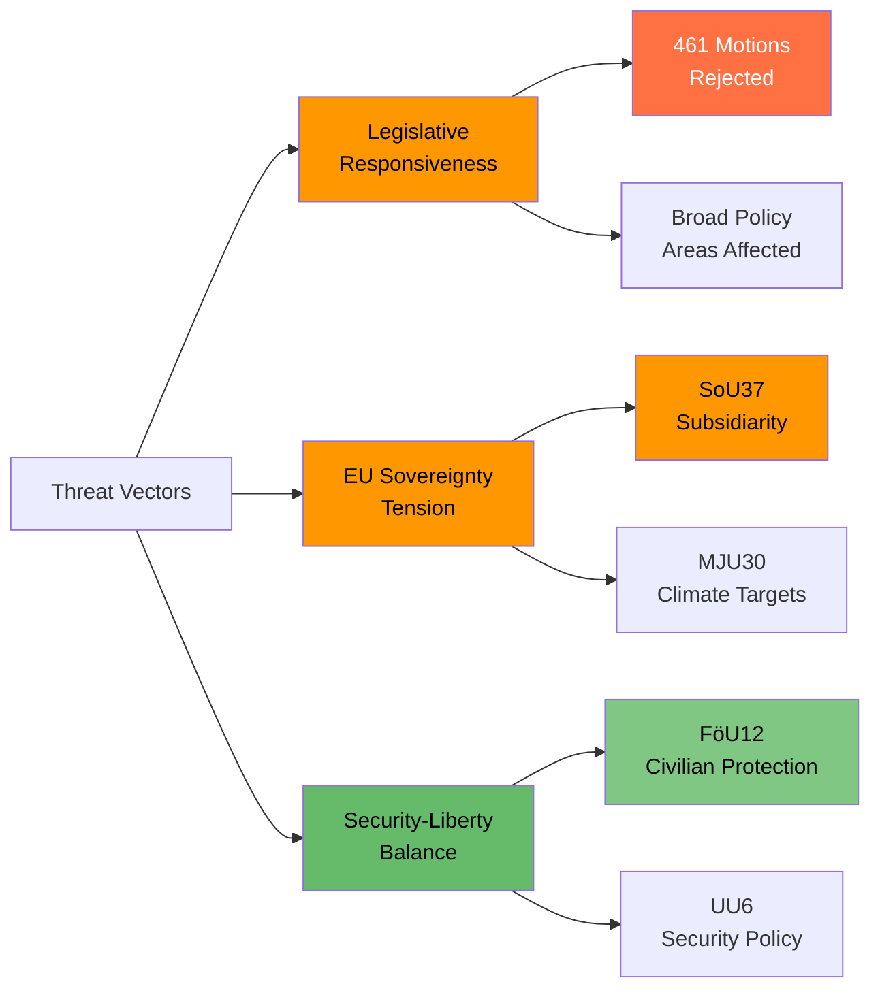

# Political Threat Analysis — 2026-04-08

| **Key** | **Value** |
|---------|-----------|
| **ID** | THR-2026-04-08-CR01 |
| **Generated** | 2026-04-08 04:32 UTC |
| **Data Sources** | get_betankanden (20 reports) |
| **Documents Analyzed** | 20 |
| **Riksmöte** | 2025/26 |
| **Overall Confidence** | MEDIUM |
| **Produced By** | AI-enhanced analysis (news-journalist agent) |

## Summary

Threat analysis across 20 committee reports identifies 3 primary threat vectors to democratic functioning: legislative responsiveness deficit from mass motion rejections, potential EU sovereignty friction, and defence-civil liberties tension during preparedness legislation.

## Threat Taxonomy Assessment

### 1. Legislative Responsiveness Deficit [MEDIUM]

| Indicator | Assessment | Evidence |
|-----------|------------|----------|
| Motion rejection pattern | 461 motions rejected across 4 reports (CU18, CU17, NU17, SoU19) | Systematic use of "ongoing work" justification |
| Policy diversity impact | Housing, consumer, energy, children — broad opposition agenda dismissed | CU18 (131), CU17 (83), NU17 (132), SoU19 (115) |
| Democratic health indicator | Parliament functioning within norms but opposition legislative impact near zero | Committee stage filtering by majority |

### 2. EU Sovereignty Tension [MEDIUM]

| Indicator | Assessment | Evidence |
|-----------|------------|----------|
| Subsidiarity challenge frequency | SoU37 motiverat yttrande — rare but significant | Parliament challenges EU on GMO/organ directive |
| Cultural sovereignty stance | KrU10 emphasizes national competence on cultural worker conditions | EU Cultural Compass response |
| Climate sovereignty | MJU30 adapts to EU framework but may weaken national ambition | EU-aligned etappmål to 2030 |

### 3. Security-Liberty Balance [LOW]

| Indicator | Assessment | Evidence |
|-----------|------------|----------|
| Civilian protection expansion | FöU12 strengthens government powers during höjd beredskap | Defence Committee report |
| Security policy scope | UU6 addresses broad security policy in NATO context | Foreign Affairs Committee |
| Civil rights safeguards | Not yet assessed — pending chamber debate details | Reservation analysis needed |

## Data Quality Notes

Threat confidence: **MEDIUM**. Assessment based on committee report metadata and summaries. Full debate transcripts not available for threat severity calibration. Vote records pending.
