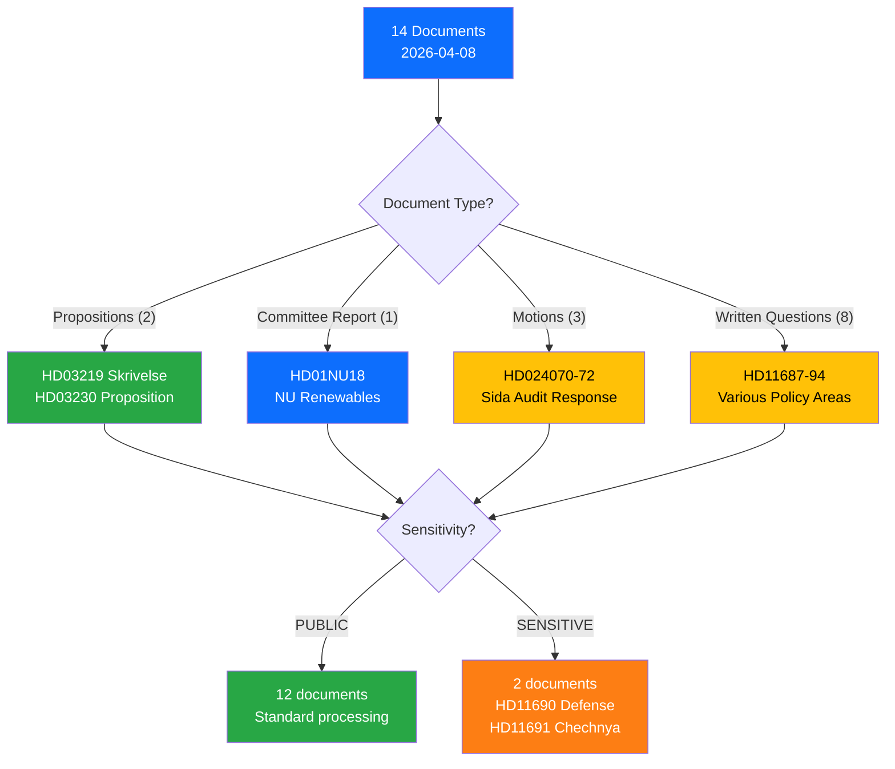

# Political Classification Results — 2026-04-08 Evening

**CLS-ID**: CLS-2026-04-08-EVE-2
**Generated**: 2026-04-08 18:31 UTC
**Riksmöte**: 2025/26
**Documents Classified**: 14
**Confidence**: HIGH

---

## Sensitivity Decision Tree

## Per-Document Classification

| dok_id | Title | Type | Sensitivity | Domain | Urgency | Significance |
|--------|-------|------|-------------|--------|---------|-------------|
| HD01NU18 | Tillståndsprövning enligt förnybartdirektivet | Committee Report | PUBLIC | Energy/Environment | MEDIUM | 7/10 |
| HD03219 | Riksrevisionens rapport om tandvårdsstödet | Gov Skrivelse | PUBLIC | Healthcare | LOW | 5/10 |
| HD03230 | Ersättning vid artskyddet | Gov Proposition | PUBLIC | Environment/Property | MEDIUM | 6/10 |
| HD024070 | Motion re: Sida humanitarian aid (1) | Motion | PUBLIC | Foreign Aid | LOW | 4/10 |
| HD024071 | Motion re: Sida humanitarian aid (2) | Motion | PUBLIC | Foreign Aid | LOW | 4/10 |
| HD024072 | Motion re: Sida humanitarian aid (3) | Motion | PUBLIC | Foreign Aid | LOW | 4/10 |
| HD11687 | Nationella kvalitetsregistren | Written Question | PUBLIC | Healthcare | LOW | 3/10 |
| HD11688 | Elbilspremie | Written Question | PUBLIC | Transport/Energy | LOW | 3/10 |
| HD11689 | Miljötillstånd | Written Question | PUBLIC | Environment | LOW | 3/10 |
| HD11690 | Privata aktörer i försvaret | Written Question | SENSITIVE | Defense/Security | MEDIUM | 5/10 |
| HD11691 | Tjetjeniens status | Written Question | SENSITIVE | Foreign Affairs | LOW | 3/10 |
| HD11692 | Beredskapspoliser | Written Question | PUBLIC | Security/Defense | LOW | 4/10 |
| HD11693 | Lobbyregister | Written Question | PUBLIC | Democracy/Transparency | LOW | 5/10 |
| HD11694 | Offentliga förtroendeuppdrag | Written Question | PUBLIC | Democracy/Governance | LOW | 3/10 |

## Domain Distribution

| Policy Domain | Count | Avg Significance |
|---------------|-------|-----------------|
| Environment/Energy | 4 | 4.75 |
| Healthcare | 2 | 4.0 |
| Defense/Security | 2 | 4.5 |
| Foreign Affairs/Aid | 4 | 3.75 |
| Democracy/Governance | 2 | 4.0 |
