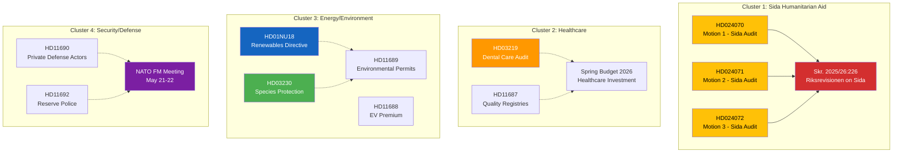

# Cross-Reference Map — 2026-04-08 Evening

**Generated**: 2026-04-08 18:31 UTC
**Riksmöte**: 2025/26
**Document Clusters**: 4

---

## Document Linkage

## Cluster Details

| Cluster | Documents | Linkage Type | Significance |
|---------|-----------|-------------|-------------|
| Sida Humanitarian Aid | HD024070, HD024071, HD024072 → Skr. 226 | Direct reference (motions respond to government skrivelse on Riksrevisionen audit) | HIGH — coordinated opposition response |
| Healthcare | HD03219 + HD11687 + Spring Budget | Thematic (dental care audit + quality registries + budget investment) | MEDIUM — policy convergence |
| Energy/Environment | HD01NU18 + HD03230 + HD11688 + HD11689 | Thematic (renewables, species protection, EV, environmental permits) | MEDIUM — green transition cluster |
| Security/Defense | HD11690 + HD11692 + NATO FM meeting | Thematic (defense actors, reserve police, NATO context) | MEDIUM — NATO integration theme |
